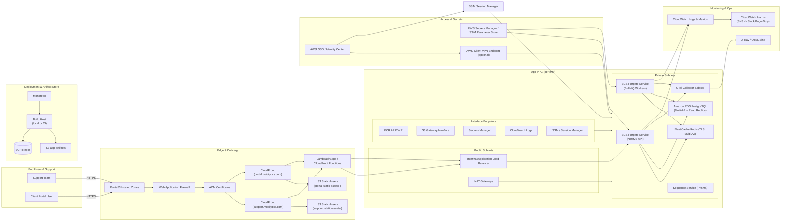

# AWS Platform Deployment Plan

This document captures the target AWS footprint for the Mobilytics App Platform and the decisions that keep the new infrastructure isolated from the legacy Terraform stack. It should be the source of truth for the first production build-out and any pre-production environments that mirror it.

---

## Scope & Goals
- Stand up a clean AWS environment for the new monorepo, without depending on or mutating the legacy Terraform state.
- Support the two core workloads today: the NestJS App API (including BullMQ workers) and the Next.js backoffice app, while reserving space for a future client-facing portal that will reuse the same delivery stack.
- Provide GitHub Actions driven CI/CD with Terraform plan/apply gates, container image publication, and deployment verification.
- Bake in observability, least-privilege IAM, and cost-aware scaling from the start.

Out of scope: migrating the legacy Django services or the historical Terraform modules; those stay read-only until we decommission them.

---

## Guiding Principles
- **Fresh Terraform root** — new backend, state bucket, and workspaces for each environment (`dev`, `staging`, `prod`). Never point these at the legacy state files.
- **Modular composition** — network, data stores, application services, and shared tooling live in discrete Terraform modules so we can iterate independently.
- **Least-privilege IAM** — workloads assume roles scoped to the resources they touch; CI uses GitHub Actions OIDC to obtain short-lived credentials.
- **Immutable deployments** — app updates ship as new container images (for API + workers) and fresh static artifacts (for the web app). No in-place edits on hosts.
- **Single source of secrets** — AWS Secrets Manager (or SSM Parameter Store) manages runtime secrets; nothing is checked into git.
- **Automated verification** — every deployment ends with smoke checks (health probes, queue lag inspection) before traffic shifts.

---

## Target Architecture Overview
- **Deployment workflow:** Short-term manual deployments (Terraform + AWS CLI) graduate to GitHub Actions once our long-term GitHub org is finalized. Both paths rely on immutable images and S3 artifacts; the doc calls out the future automation explicitly.
- **Networking:** Single VPC per environment across three AZs with segregated public (ALB/NAT) and private (ECS, RDS, Redis) subnets. Interface endpoints keep service traffic private (S3, Secrets Manager, CloudWatch Logs, ECR, SSM).
- **Application layer:** ECS Fargate services for the NestJS API (behind an internal ALB) and BullMQ workers (headless). Autoscaling is driven by latency/utilization for the API and queue depth for workers. Tasks pull secrets from AWS Secrets Manager/SSM and export telemetry via OpenTelemetry sidecars.
- **Async processing:** ElastiCache for Redis (TLS, AUTH rotation, Multi-AZ failover). MemoryDB remains an upgrade path if durability requirements increase.
- **Data stores:** Amazon RDS for PostgreSQL with Multi-AZ, automated backups, PITR, and parameter groups tuned for Prisma. Read replicas optional for reporting workloads. S3 buckets support bulk import/export workflows.
- **Frontend delivery:** Two Next.js surfaces share the same delivery stack. Internal support UI and future client portal push static assets to S3 and serve through dedicated CloudFront distributions; SSR/ISR routes call back into the private ALB via Lambda@Edge or CloudFront Functions + API forwarding.
- **Observability:** CloudWatch Logs/Insights, metrics + alarms (API latency, ECS health, Redis memory, queue backlog). AWS Distro for OpenTelemetry/X-Ray provides traces; plan for optional third-party sinks later.
- **Security & access:** Route53 hosts public DNS (`api.mobilytics.com`, `support.mobilytics.com`, `portal.mobilytics.com`). ACM certs terminate at CloudFront/ALB. IAM roles are scoped per workload; ops access flows through AWS SSO + SSM Session Manager. Attach WAF once environments harden; sandbox/dev may skip initially.

---

### Architecture Diagram

---

## Deployment Workflow

### Phase 0 – Manual Sandbox (short-term)
- Engineers assume the deploy role via AWS SSO/`aws-vault`, run Terraform locally (separate backend + workspace for sandbox), and execute `terraform apply` on demand.
- API + worker images are built locally with `docker build` and pushed using `aws ecr get-login-password`; ECS services are refreshed via `aws ecs update-service --force-new-deployment`.
- Frontend assets deploy through `next build && next export` followed by `aws s3 sync` and an `aws cloudfront create-invalidation`.
- Secrets are added/rotated manually in Secrets Manager/SSM with a runbook. CI is limited to lint/test checks; no automated applies yet.

### Phase 1 – Hardened Automation (target)
- GitHub Actions (or the selected CI provider) runs Terraform `fmt`/`validate`/`plan` on pull requests and gated `apply` on protected branches using OIDC federation.
- The pipeline builds/pushes versioned container images, updates ECS task definitions, syncs S3 assets, publishes Lambda@Edge bundles, and invalidates CloudFront.
- Post-deploy smoke tests check API health, queue depth, and SSR endpoints. Failed checks trigger automatic rollback to the previous ECS task definition/s3 asset set.
- Environment promotions remain explicit (`dev → staging → prod`) by binding each workspace/role ARN to a dedicated job.

> Until the GitHub organization decision is finalized we stay in Phase 0. Document every manual step so Phase 1 automation is a direct translation, not a redesign.

---

## Infrastructure Modules

### Networking
- VPC module (CIDR per environment) with:
  - 3 public subnets (one per AZ) hosting Internet/NAT gateways.
  - 3 private subnets for application services.
  - Route tables per subnet tier.
  - VPC endpoints for S3, Secrets Manager, CloudWatch Logs, ECR (api + dkr), and SSM.
- Shared security group baseline (ingress from ALB only, egress limited to required ports).

### Compute
- `app_api` ECS service: autoscaling based on CPU, memory, and p99 latency. Minimum 2 tasks (across AZs) for HA.
- `bullmq_workers` ECS service: autoscaling based on queue depth + custom CloudWatch metric. Optionally run multiple worker task definitions for distinct queues.
- Optional Lambda functions for scheduled jobs (nightly mirror refresh) using EventBridge Scheduler.

### Data
- Amazon RDS PostgreSQL (Multi-AZ, automatic minor upgrades). Parameter group tuned for Prisma connection pooling; use RDS Proxy if connection churn becomes an issue.
- ElastiCache Redis (TLS enabled, auth token rotated via Secrets Manager). Enable automatic failover and set slow-log monitoring for queue debugging.
- S3 buckets:
  - `support-static-assets-<env>` (versioned) for the backoffice Next.js build.
  - `portal-static-assets-<env>` reserved for the future client-facing portal build.
  - `app-artifacts` for deployment artifacts (e.g., Terraform state backups, optional).

### Observability
- CloudWatch log groups per service with 30-day retention by default (override per env).
- CloudWatch dashboards for API latency, ECS task health, Redis memory usage, queue depth.
- SNS-backed alarms for high error rate, unhealthy tasks, or replication lag.
- Optional OpenTelemetry Collector sidecar or centralized service for traces forwarded to AWS X-Ray.

### Security & Secrets
- IAM roles:
  - `PlatformDeployRole` assumed either manually (Phase 0) or via CI (Phase 1) with permissions for Terraform apply, ECR push, S3 sync, CloudFront invalidations, and ECS deploys.
  - Service roles for ECS tasks with scoped access to Secrets Manager/Parameter Store entries and S3 buckets.
- Secrets Manager hierarchy: `/mobilytics/<env>/<service>/<name>` (e.g., `/mobilytics/prod/app-api/database-url`).
- KMS keys for Secrets Manager, SSM, and S3 buckets requiring encryption at rest.
- GuardDuty, Config, and CloudTrail enabled in the account (can be inherited from org-level).

### Developer Access Strategy
- Prefer *AWS Client VPN* (or AWS VPN Client) for developers who need direct VPC access. It offers device-level authentication (SAML/SAML-based MFA via AWS SSO), integrates with security groups, and keeps engineers on their local workstation instead of a jump host.
- Complement VPN access with *AWS Systems Manager Session Manager* for ad-hoc shell access to ECS exec or EC2 utility instances without exposing inbound ports.
- Retain a bastion host only as a contingency; if introduced, restrict it to break-glass use with short-lived IAM sessions, no permanent SSH keys.
- Document onboarding/offboarding steps, MFA requirements, and acceptable use in the runbook so support/engineering understand how to reach private resources securely.
- For sandbox/dev, the VPN can be optional if all services expose HTTPS endpoints; production/staging should require VPN or SSM for privileged operations (database migrations, queue inspection, etc.).

---

## Migration & Rollout Strategy
1. **Bootstrap**
   - Create Terraform backend (S3 + DynamoDB lock table) and initial workspaces.
   - Deploy shared networking, baseline IAM, and observability tooling.
2. **Non-production environments**
   - Stand up `dev` with ECS, RDS, Redis, and CI/CD integration.
   - Validate local-to-cloud flows (GitHub Actions deployment, smoke tests, queue processing, mirror refresh jobs).
3. **Production readiness**
   - Harden security (WAF rules, AWS Shield if required, mandatory TLS 1.2).
   - Configure backups, PITR validation, and disaster recovery drills.
   - Set up alerting hooks (PagerDuty, Slack).
4. **Cutover**
   - Run old and new stacks in parallel; sync databases if necessary.
   - Update Route53 records to point the primary domains at CloudFront (frontend) and the new API ALB.
   - Monitor metrics closely for 24–48 hours before decommissioning legacy paths.
5. **Decommission**
   - Archive legacy Terraform repo (read-only).
   - Clean up unused AWS resources to avoid drift and extra cost.

---

## Open Questions & Next Steps
- Do we need a publicly accessible API in addition to the backoffice tooling? If so, factor in separate throttling/WAF requirements.
- Decide between Lambda@Edge versus fully static export for the Next.js backoffice. A static build simplifies hosting but may constrain future SSR features.
- Confirm whether BullMQ workers require privileged VPC access to legacy systems; incorporate VPC peering or AWS PrivateLink if needed.
- Define the disaster recovery strategy (cross-region replicas, backups, RTO/RPO targets).
- Evaluate third-party observability providers (Datadog, Honeycomb) and integrate if selected.
- TODO: Produce Terraform module stubs that match this plan and add them to this repository (`infrastructure/terraform/...`).
- Confirm the go-live requirements for the client-facing portal (auth model, CDN caching strategy) so the shared infrastructure can accommodate it without disruptive changes.
- Gather projected usage/storage metrics (API RPS, concurrent jobs, Postgres data growth, Redis memory footprint) to right-size RDS, ECS, and Redis tiers before production cutover.

---

Keep this document updated as we refine the architecture, add environments, or adopt new AWS services. It should reflect the latest decisions so onboarding engineers can ramp quickly and avoid legacy pitfalls.
