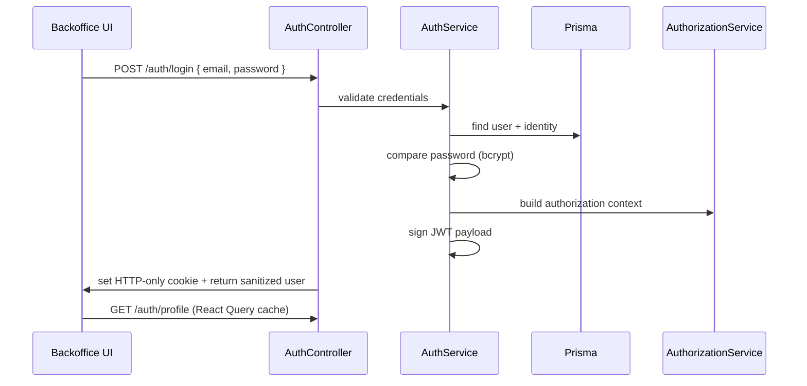

# Domain Architecture – Authentication & Authorization

> Applies ADRs: 0001 (CUID identifiers), 0003 (human-readable references), 0004 (Prisma style), 0005 (authorization model), 0006 (configuration), 0007 (service guidelines). Builds on the shared backoffice authentication plan.

## 1. Purpose
- Provide a unified authentication surface (email/password + Google OAuth) for all Mobilytics backoffice applications.
- Enforce authorization consistently across Nest controllers using data-driven permissions.
- Expose a predictable session contract to front-ends (JWT + HTTP-only cookie) with support for service-to-service calls.

## 2. Responsibilities & Interfaces
- **Owns:** User identities, credential validation, session issuance, role → permission mapping, auth-related middleware/guards.
- **Collaborates:** Configuration module (JWT, cookie, OAuth settings), Prisma user/staff models, front-end login flows, authorization decorators on feature modules.
- **Out of scope:** Customer-facing auth (handled by separate domains), long-lived API tokens (future work), legacy auth migration.

## 3. Key Components
| Layer | Location | Responsibility |
| --- | --- | --- |
| Prisma models | `prisma/schema.prisma` (`User`, `UserIdentity`, `AdministratorStaff`, `SupportStaff`, `OperationsStaff`) | Persist credentials, provider identities, and staff roles. |
| Configuration | `src/config` (`configuration.ts`, `config.service.ts`) | Load & validate JWT/OAuth/cookie settings (ADR‑0006). |
| Auth module | `src/auth/auth.module.ts` | Registers controllers, services, decorators, guards, and Passport strategies. |
| Auth service | `src/auth/auth.service.ts` | Email/OAuth login, registration, token issuance, logout. |
| Authorization service | `src/auth/authorization.service.ts` | Build `allow`/`deny` rule sets and actor roles from database entries. |
| Guards | `src/auth/guards` | `JwtAuthGuard` validates sessions; `AuthzGuard` enforces `@Require` metadata (ADR‑0005). |
| Decorators | `src/auth/decorators/require.decorator.ts` | Attach action/resource metadata to endpoints. |
| Strategies | `src/auth/strategies/jwt.strategy.ts`, `google.strategy.ts` | Parse JWTs or handle Google OAuth callbacks. |
| Cookie helpers | `src/auth/utils/auth-cookie.ts` | Consistent secure cookie handling (domain, SameSite, expiration). |
| Front-end integration | `apps/backoffice-support` (`useAuthUser`, `login-form`, middleware) | Fetch profile, gate routes, manage login/logout UX. |

## 4. Authentication Flow

- Google OAuth follows the same path after Passport strategy populates `OAuthProfile`.
- Cookie attributes derive from config (domain, max-age). `logout` clears the cookie via helper.

## 5. Authorization Flow
1. Controllers decorate endpoints with `@Require(action, resource)` (e.g., `@Require('read', 'orders')`).
2. `JwtAuthGuard` runs first: validates JWT from cookie or `Authorization` header, attaches `authUser` to the request.
3. `AuthzGuard` reads metadata, normalizes resource strings (`orders/123/status` → `orders/**`), and checks `allow`/`deny` globs.
4. Access is granted if rule matches; otherwise `403` is returned with audit logging.

### Roles & Rules
| Role | Data source | Allow | Deny |
| --- | --- | --- | --- |
| `ADMINISTRATOR` | `AdministratorStaff` | `**:*` | none |
| `SUPPORT` | `SupportStaff` | `**:*` | `platform/users:manage` |
| `OPERATIONS` | `OperationsStaff` | `**:*` | `platform/users:manage` |

Add or adjust roles by updating `AuthorizationService` mappings and seeding staff tables.

## 6. Session & Security Considerations
- **JWT payload:** Includes `userId`, display info, `roles`, `allow`, `deny`, and `impersonated` flag (future). Tokens signed with `JWT_SECRET`.
- **Cookies:** `httpOnly`, `secure` in production, `SameSite='none'` for shared domains, adjustable via config.
- **CORS:** Derived from `FRONTEND_URL` + `CORS_ORIGINS` slices; same service handles additional front-ends.
- **Seed data:** `pnpm prisma:app-api:seed` (or `pnpm dev-seed`) creates default admin credentials for local work.
- **Password hashing:** bcrypt (10 rounds). Reset flow reuses the same hashing utilities.

## 7. Integration Points
- **Feature Modules:** Import `AuthzModule` indirectly by using `@Require` and guards; no direct coupling required.
- **Payments / Stripe:** Webhook endpoints rely on `JwtAuthGuard` bypass (public) but still use `AuthorizationService` for internal actions.
- **Front-end:** `useAuthUser` fetches `/auth/profile`; middleware in `apps/backoffice-support/middleware.ts` pre-checks cookies for server navigation.
- **Telemetry:** Login success/failure logged via Nest logger; hook into metrics once centralized observability lands.

## 8. Non-functional Requirements
- Fail fast on invalid environment variables (ADR‑0006 validation).
- Ensure Google OAuth keys optional in lower environments; module should still boot in password-only mode.
- Provide structured audit logs for login attempts and authorization failures (TODO: integrate with centralized logging).
- Keep JWT expiration configurable; current default is `1h` with refresh via re-login.

## 9. Open Follow-Ups
- Self-service password reset & MFA (future).
- API tokens/service-to-service auth (future ADR).
- Admin UI for managing staff roles and audit trails.
- Consolidated impersonation support (requires additional guard checks).

Refer to ADR-0005 for design rationale and to `docs/local-development.md` for environment setup.
