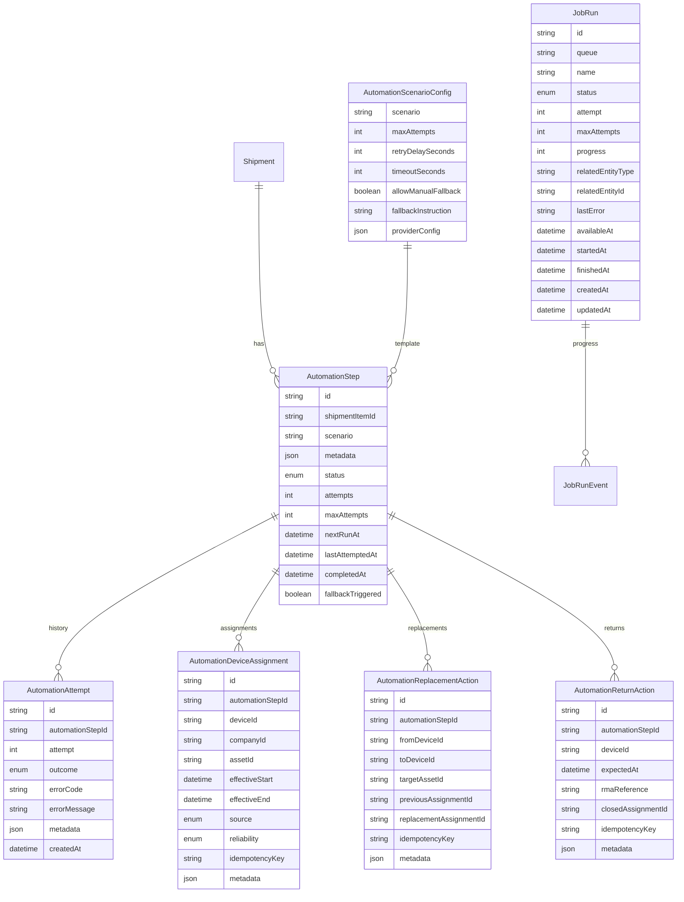
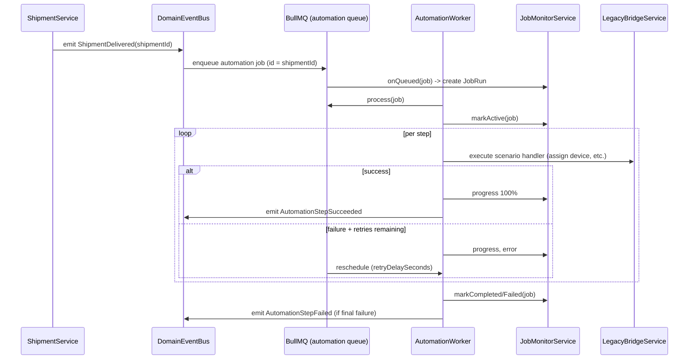

# Domain Architecture – Automation & Async Processing

> Applies ADRs: 0001 (CUID IDs), 0003 (human-readable references), 0004 (Prisma style), 0005 (authz-aware APIs), 0006 (config centralisation), 0007 (service guidelines), 0008 (legacy linkage). Builds on BullMQ decision and domain event bus plan.

## 1. Mission
- Execute post-fulfillment automations (device provisioning, replacements, returns) reliably and transparently.
- Provide a shared async execution substrate (BullMQ) for automation, shipment tracking, retarget orchestration, and future workloads.
- Surface job health to Support/Ops without exposing infrastructure tooling.

## 2. Responsibilities
- **AutomationService**: CRUD for automation steps, attach configs, orchestrate execution.
- **AutomationWorker**: BullMQ processor executing scenario handlers with retries/backoff.
- **JobMonitorService**: persists job runs, exposes dashboards via API (`/v1/job-runs`, `/v1/job-queues`).
- **JobSchedulerService**: orchestrates BullMQ repeatables/cron triggers (automation retries, shipment tracking refresh, nightly legacy sync).
- **EventBusFacade**: wraps Nest `EventEmitter2`, persists domain events, broadcasts to listeners.
- **RetargetOrchestrator** (future): chunk long-running retarget exports, monitor progress, bridge to legacy heavy-lift API.
- **TrackingAdapters**: carrier-specific connectors (USPS, DHL Express, Canada Post, Chit Chats) that ingest webhook/poll responses and enqueue normalised shipment events.

## 2.1 Courier Tracking Overview
- **Shipping configuration** lives in `Courier` + `Courier.metadata`; a planned `ShippingConfigService` exposes CRUD + validation for credentials, webhook targets, polling cadence, and per-carrier preferences.
- **Adapters** run inside the same Nest context: webhook controllers push raw payloads to BullMQ; scheduled polling jobs (driven by `JobSchedulerService`) fetch carrier status and enqueue normalised messages when webhooks are unavailable.
- **TrackingWorker** (BullMQ queue `shipment-tracking`):
  1. Consume normalised event jobs (`{ carrier, trackingNumber, events… }`).
  2. Persist to `ShipmentEvent`, update shipment status/metadata, and append to `JobRun` telemetry.
  3. Emit domain events (`shipment.event_recorded`, `shipment.delivered`) and recompute fulfillment status; automation dispatch remains gated on delivered shipments.
- **Current state:** USPS, DHL Express, Canada Post, and Chit Chats adapters are implemented. USPS/DHL rely on webhook ingestion; Canada Post & Chit Chats leverage scheduled polling jobs. Automation worker publishes retry/fallback events and still stubs legacy bridge interactions pending integration.
- **JobMonitorService** records queue activity for Support via `/v1/job-runs` and `/v1/job-queues`, surfacing linked entities and timing metrics.
- Adapters share util libraries for signature validation, retry cadence, and carrier → `ShipmentStatus` mappings.

## 2.2 Developer Tooling & Local Simulation
- Local development flows require deterministic courier feedback. A lightweight simulator (initially `scripts/dev/courier-simulator.sh`, later a Nest dev-only route) replays canonical webhook/poll payloads every 60–120 seconds while the local stack runs. The task seeds USPS/DHL delivered events plus polling-based carriers so engineers see shipment timelines, automation triggers, and Support UI updates without external carrier access.
- The simulator can also be triggered ad-hoc via `pnpm --filter @mobilytics/app-api courier:simulate` to help QA reproduce scenarios. Each replay call writes structured `JobRunEvent` notes so it is obvious in logs when a synthetic event fired.
- When the Support dev UI is running, an “Inject courier events” action calls the same simulator endpoint, allowing product demos to drive shipping and automation flows live.
- Simulator payloads are versioned fixtures checked into `apps/app-api/test/fixtures/courier/` to keep them in sync with adapters as schemas evolve. Adding a new carrier adapter mandates adding fixture coverage plus simulator hooks.

## 3. Data Model

- Job statuses: `QUEUED`, `ACTIVE`, `COMPLETED`, `FAILED`, `DELAYED`.
- `JobRunEvent` captures progress snapshots (text note, percentage).
- All IDs CUID (ADR 0001). `JobRun` may also expose human-readable ref if needed for Support (`JOB-000123`).
- Scenario metadata that does not have a dedicated column (notes, debug overrides) remains in `AutomationStep.metadata`; device/asset references live in the structured tables above to satisfy ADR 0007/0008 and unblock relational validation.

## 4. Event Bus & Job Flow


## 5. BullMQ Configuration
- Queues: `automation`, `shipment-tracking`, `retarget`.
- Redis connection pulled from `AppConfigService.queue.redisUrl`.
- Global settings:
  - Concurrency: automation (5), tracking (10), retarget (2).
  - Job timeout: automation 5m (per-step), retarget orchestrator 45m, with heartbeat progress updates.
  - Backoff strategies per scenario (exponential default). Future Temporal migration possible by reimplementing `QueueScheduler` interface.
- `QueueInitializer` registers event listeners to feed `JobMonitorService`.

## 6. Support Visibility
- `JobMonitorService` writes/updates `JobRun` and `JobRunEvent` rows.
- API:
  - `GET /v1/job-runs?queue=&status=&entityType=&entityId=`.
  - `GET /v1/job-runs/:id` includes history, linked automation steps/shipments.
- Support UI surfaces:
  - Global background tasks page (grouped by queue).
  - Inline cards on Shipment detail showing automation job progress.
- Sensitive operational fields (Redis keys, raw payloads) hidden; only domain context returned.

## 7. Scenario Handlers
- Pluggable handler map: `AutomationScenarioRegistry` registers functions keyed by scenario.
- Handler signature: `(context: {step, shipment, company, attempt, logger, legacyClient}) => Promise<AutomationResult>`.
- Handlers must be idempotent: rely on `step.id` and underlying domain operations to enforce at-most-once semantics (e.g., device assignment uses idempotency keys).
- Timeout enforcement: worker wraps handler with `Promise.race` vs configured timeout.
- Manual fallback: if `allowManualFallback` true and max attempts reached, Support can invoke `POST /v1/automation-steps/:id/fallback` providing notes. Status transitions to `FALLBACK`, job flagged completed with manual resolution requirement.

## 8. Sensor Hardware Automation Scenarios
| Scenario key | Trigger | Required payload fields | Core actions | Success signal | Fallback guidance |
| --- | --- | --- | --- | --- | --- |
| `sensor_vendor_first_time` | Shipment delivered containing first-time vendor devices | `deviceIds[]`, `activationDeadline?` | Assign devices to company in the modern assignment store, emit assignment history window, mirror to legacy bridge, create activation tasks with deadline | Modern assignment saved + legacy bridge acknowledgment; activation task created | Notify Ops to create activation task manually in legacy UI and update shipment notes |
| `sensor_partner_first_time` | First-time devices managed by partner | `deviceIds[]`, `partnerId`, `activationDeadline?` | Assign devices to partner account in modern store, enqueue partner onboarding workflow, mark devices as pending activation, mirror assignment to legacy | Partner onboarding API acknowledges; modern + legacy assignments aligned | Engage partner success team to complete onboarding manually; update step notes |
| `sensor_vendor_replacement` | Replacement hardware shipment | `mappings[]` (`deviceId`, `replacementDeviceId`, `targetAssetId?`), `notes?` | For each mapping: validate existing assignment window, record replacement in modern history, update target asset linkage, mirror swap via legacy bridge, record replacement audit event | Replacement records written to modern history + mirrored legacy association | Ops to perform swap manually in legacy admin for any failed mapping, then mark step fallback with reference ticket |
| `sensor_partner_replacement` | Partner-managed replacement | `mappings[]` (`deviceId`, `replacementDeviceId`, `targetAssetId?`), `partnerId`, `notes?` | For each mapping: coordinate partner API, update modern assignment history, ensure partner metadata synced, mirror to legacy | Partner API acknowledges every mapping; modern + legacy assignments aligned | Coordinate with partner manually per mapping, document case in CRM, then mark fallback |
| `sensor_return` | Return logistics for shipped devices | `deviceIds[]`, `rmaId?`, `notes?`, `expectedAt?` | Create return expectations, notify warehouse, update device state to `in_transit_return`, schedule follow-up | Return expectation record created + notification dispatched | Warehouse to track return manually, update expectation via admin tool |

- Scenario payloads validated by DTO layer before persisting; DTOs write to the structured `Automation*` tables (assignments, replacements, returns) and only keep free-form notes/debug flags in `AutomationStep.metadata`. Missing required fields block shipment readiness.
- Replacement scenarios accept multiple mappings to handle multi-device shipments; payload example:
```json
{
  "mappings": [
    {"deviceId": "dev_old_1", "replacementDeviceId": "dev_new_1", "targetAssetId": "asset_1"},
    {"deviceId": "dev_old_2", "replacementDeviceId": "dev_new_2"}
  ],
  "notes": "Batch replacement for warehouse expansion"
}
```
- The example above is persisted as two `AutomationReplacementAction` rows plus a single `AutomationStep` metadata record containing the human note.
- Handlers rely on `DeviceAssignmentService` to create authoritative assignment windows (`deviceId`, `companyId`, `assetId`, `startsAt`, `endsAt`). Successful writes update the related `Automation*Action` row (`replacementAssignmentId`, `closedAssignmentId`, etc.) so we always know which history record was touched. Once persisted, the handler invokes `LegacyBridgeService` (`assignDevices`, `swapDevice`, `recordReturnExpectation`) using the automation step id as the idempotency token to keep the legacy system in sync.
- Completion emits `AutomationStepSucceeded` with structured metadata (e.g., assigned device ids, partner response).
- Business events appended to shipment timeline for visibility (e.g., “Replacement complete for DEV-123 → DEV-456”).
- SLA defaults (configurable): first-time setup within 5 business days, replacement within 2 business days, returns acknowledgment within 1 business day.

## 8. Retarget Orchestration (Future)
- Domain event `RetargetBatchRequested` enqueues orchestrator job.
- Orchestrator loads queue snapshot (thousands of sensor location records), chunks into batch jobs (e.g., 5k records each), and delegates heavy processing to legacy API using existing endpoints.
- Maintains `RetargetBatch` table with `progressCount`, `totalCount`, `status`.
- Uses same JobRun infrastructure for visibility.
- If workflow exceeds BullMQ capabilities (chained sagas, human steps), interface allows migration to Temporal with minimal domain changes.

## 9. Integration Points
- **Fulfillment/Shipments:** Provide shipment + item context to automation.
- **Device Assignment Service:** Owns authoritative device↔company↔asset history, enforces non-overlapping windows, and publishes events consumed by timelines and analytics.
- **Legacy Bridge:** Receives mirrored assignment operations and other device/asset updates; circuit breaker errors bubble into automation attempts with typed codes so we can surface partial-sync states.
- **Orders:** Receives completion event to mark fulfillment complete when all steps succeed.
- **Notifications:** Domain events forwarded to Notification service (future) for Slack/email alerts on failures.
- **Domain Event Bus:** Automation publishes status events (`AutomationStepQueued/Succeeded/Failed`) via the shared bus so timelines and alerting stay consistent (`domain-event-bus.md`).

## 10. Non-functional Requirements
- Persist audit trail for every attempt (ADR 0007).
- Observability: metrics (`automation_attempts_total`, `automation_failures_total`, `job_queue_wait_seconds`). Integrate with Prometheus.
- Config toggles (ADR 0006) to disable specific scenarios in lower environments.
- Health checks verifying queue connectivity and worker heartbeat (expose via `/health/automation`).
- Unit tests for scenario handlers (mock legacy client). Integration tests using in-memory BullMQ + sqlite to validate retries and fallback.
- Local simulator tasks must be idempotent and safe to run alongside real carrier events; simulator runs tag `JobRun` entries (`source=dev-sim`) so production alerts can ignore them.

## 11. Open Questions
- SLA for automation completion? (default 15m after delivery until defined).
- Should manual fallback trigger notifications automatically? (pending stakeholder decision).
- Criteria for graduating to Temporal (e.g., orchestrations requiring compensation flows).
