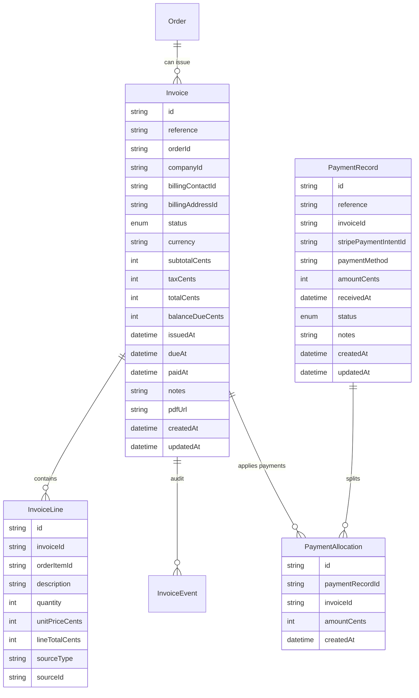
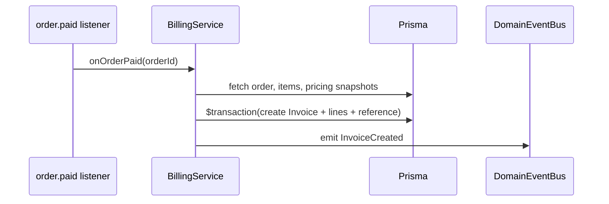
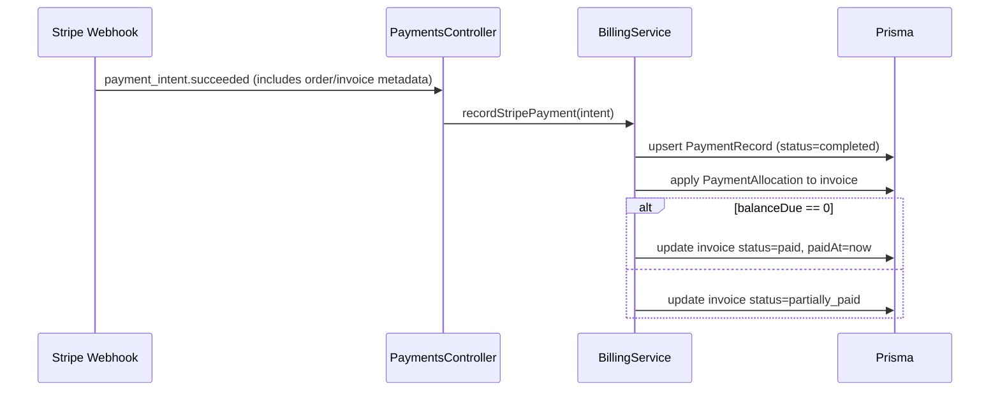

# Domain Architecture – Billing & Invoices

> Applies ADRs: 0001 (CUID IDs), 0003 (human references), 0004 (Prisma style), 0005 (authz), 0006 (config), 0007 (service guidelines), 0008 (legacy linkage). Builds on orders/pricing and payment integration choices.

## 1. Purpose
- Provide financial documents (invoices, receipts) tied to orders so companies can view charges, track payments, and download statements.
- Support Support/Ops workflows: issuing invoices, tracking payment status, reconciling Stripe transactions, and handling manual payments/credits.
- Serve as foundation for customer-facing invoice history and integration with accounting systems.

## 2. Scope & Boundaries
- **Owns:** Invoice lifecycle, invoice numbering, line item breakdowns, balance tracking, payment allocation, PDF artifacts, email delivery.
- **Collaborates:** Orders & pricing (source of line items), Stripe payments (checkout/session sync), Fulfillment (for delivery milestones triggering invoice issuance), Contacts/Addresses (billing contact/address), Automation (notifications).
- **Out of scope:** Full general ledger, complex tax jurisdiction rules (future), subscription invoicing (future expansion).

## 3. Data Model

- `Invoice.reference` uses `INV-000123` sequence (ADR 0003). Payment records use `PAY-000123`.
- Status enums:
  - Invoice: `draft`, `issued`, `partially_paid`, `paid`, `void`.
  - PaymentRecord: `pending`, `completed`, `failed`, `refunded`.
- `InvoiceLine.sourceType` values: `ORDER_ITEM`, `ADJUSTMENT`, `DISCOUNT`, `TAX`. `sourceId` references original entity when applicable.
- Balance calculation: `balanceDue = total - Σ(completed payment allocations)`.

## 4. Key Flows
### 4.1 Invoice Creation on Payment

- Triggered when the payments module publishes `order.paid`. Issue invoice immediately (`status=issued`, `issuedAt=now`, `dueAt=issuedAt` if prepaid). For manual invoicing workflows, allow Support to create invoice in `draft` and issue later.

### 4.2 Payment Allocation from Stripe

- Manual payments: Support can record via `POST /v1/invoices/:id/payments` specifying method (`wire`, `check`) with proof details.

### 4.3 Customer Visibility
- Support/Ops UI: invoice list per company, invoices detail (lines, payments, balance).
- Customer-facing portal (new Next.js app under `apps/billing-portal`): handles checkout success/failure redirects, shows receipt context (order reference, amount, payment date), and provides authenticated access to historical invoices plus download links. Version 1 authenticates via signed session tokens embedded in the Stripe checkout success URL; future versions will support direct login via company SSO or magic links.
- Portal pulls data via public-safe endpoints (`/v1/customer-portal/orders/:orderId`, `/v1/customer-portal/invoices`) that wrap existing billing services but enforce tenant scoping and rate limits. The same pages are reused when Support re-sends receipt links to customers.
- PDF generation via background job (BullMQ) using template; stored in object storage, URL saved to invoice. Portal links use short-lived signed URLs so customers never touch raw storage paths.

## 5. API Surface
- `GET /v1/invoices` filters: `companyId`, `status`, `dueBefore`, `orderId`.
- `POST /v1/orders/:orderId/invoices` – manual issuance (optional for partial shipments or staged billing).
- `GET /v1/invoices/:id` – includes lines, payments, events.
- `POST /v1/invoices/:id/issue` – transitions from draft to issued.
- `POST /v1/invoices/:id/void` – mark as void (requires reason).
- `POST /v1/invoices/:id/payments` – record manual payment.
- `GET /v1/invoices/:id/pdf` – returns secure URL.
- `GET /v1/invoices/:id/events` – audit timeline.
- Guarded by auth policies `invoices:read`, `invoices:manage`.

## 6. Integrations
- **Orders:** On initial Stripe checkout success, invoice is generated automatically. Order detail surfaces invoice status/balance. Potential support for multiple invoices per order (e.g., staged billing) by associating with the same order id.
- **Pricing:** Inherits price snapshots from order items to ensure financial consistency.
- **Payments:** Stripe metadata includes `invoice_reference` or `order_id` for reconciliation; manual payment entry uses same service. The Nest API becomes the primary Stripe webhook endpoint and forwards relevant events to the legacy Django webhook until the old stack is retired. Fan-out is implemented via an internal queue so failures in the legacy path never block the new billing workflow.
- **Fulfillment:** Optionally tie invoice issuance to fulfillment status (e.g., issue when shipment moves to `in_transit` for net terms customers). Configurable per company.
- **Automation:** Domain events (`InvoiceIssued`, `InvoicePaid`, `InvoiceOverdue`) feed notifications and dashboards.
- **Job Monitoring:** PDF generation and overdue reminder jobs tracked via `JobRun` infrastructure.
- **Domain Event Bus:** Billing publishes `InvoiceIssued`, `InvoicePaid`, and `InvoiceOverdue` events through the shared bus for timelines, reminders, and analytics (`domain-event-bus.md`).

### Stripe Webhook Delivery & Fan-out
- Stripe forwards all payment-related events to the Nest webhook endpoint (`/v1/webhooks/stripe`). The handler persists or updates payments, then enqueues a `stripe-webhook.forward` job that replays the payload (with signatures stripped) to the legacy Django webhook so the existing workflows continue to function.
- Forwarding jobs include idempotency keys (`event.id`) to avoid duplicate delivery. Failures increment a retry counter and alert Support after configurable thresholds. Events that cannot be forwarded are still processed locally and land in a dead-letter queue with a remediation playbook.
- Once the legacy system no longer needs a given event type, we can toggle fan-out per type via configuration (`STRIPE_WEBHOOK_FANOUT_DISABLED_EVENTS`).

### Local Development Tooling
- `scripts/stack.sh start-dev` (and the VSCode task) spawn `stripe listen --forward-to http://localhost:4000/v1/webhooks/stripe` automatically when a developer has the Stripe CLI installed. The script writes received webhook payloads to `tmp/stripe-webhooks.log` for debugging.
- Developers can skip the listener via `SKIP_STRIPE_LISTENER=1` or choose a different account key with `STRIPE_LISTENER_KEY`. When running integration tests, the listener is disabled and replaced with fixture-driven requests.
- A convenience command `pnpm --filter @mobilytics/app-api stripe:replay <eventId>` replays captured events through the local webhook handler to verify idempotency and end-to-end flows after code changes.

### Customer Billing Portal
- The customer portal app is deployed separately (Netlify/Vercel) and receives the Stripe checkout `success_url` / `cancel_url` callbacks. It validates the session token with the Nest API before showing receipt details or errors.
- Portal pages rely on public OAuth scopes (`customer_portal.read`) and sign requests with short-lived JWTs. Manual invoice emails include the same portal links so customers have a single destination for outstanding and paid invoices.

## 7. Non-functional Requirements
- All tables follow ADR 0004 style and audit logging (create `InvoiceEvent`, `PaymentEvent`).
- Enforce monetary integrity via database constraints (check `amount >= 0`, `balance >= 0`).
- Ensure idempotency: Stripe webhooks include `idempotencyKey` to avoid duplicate payment records.
- Config-driven payment terms: default 0 (due on receipt) but allow overrides per company.
- Provide metrics: outstanding AR balances, overdue invoice counts, average days to pay.
- Ensure PDF storage follows security guidelines (signed URL expiry).
- Webhook fan-out must degrade gracefully: processing in the new API never depends on the legacy forward succeeding, and circuit-breaker metrics surface lag between systems.
- Local Stripe listener scripts detect missing CLI binaries and print actionable instructions; the tooling must never block stack startup.

## 8. Roadmap
- **Phase A:** Add invoice schema, service, basic UI integration (list + detail) triggered on order payment.
- **Phase B:** Manual invoice creation, partial payment support, PDF generation job, Stripe webhook fan-out queue, and automated local Stripe CLI listener during dev stack bootstrap.
- **Phase C:** Automated reminders & overdue notifications, launch customer-facing billing portal + checkout success/failure flows, and expose read-only customer APIs with signed tokens.
- **Phase D:** Integrate with accounting export (CSV, QuickBooks/Xero connectors) and retire Stripe webhook fan-out once legacy dependencies are removed.

## 9. Open Questions
- Do we need support for multi-order invoices or credits applied across orders? (likely future ADR).
- Should overdue reminders be per-invoice or per-company digest? (product decision).
- Need to confirm tax handling requirements beyond simple flat rate (may require tax service integration).
- How do we authenticate long-lived customer portal sessions (magic link vs. embedded token) once we move beyond Stripe redirect flows?
