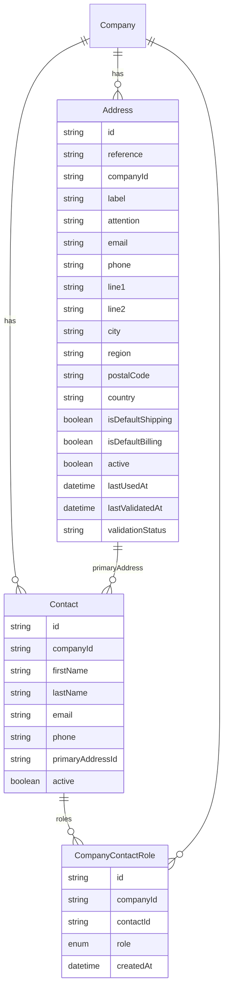
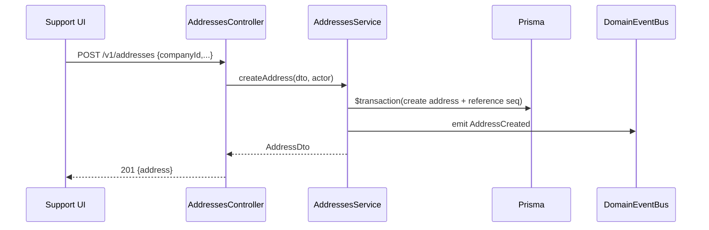
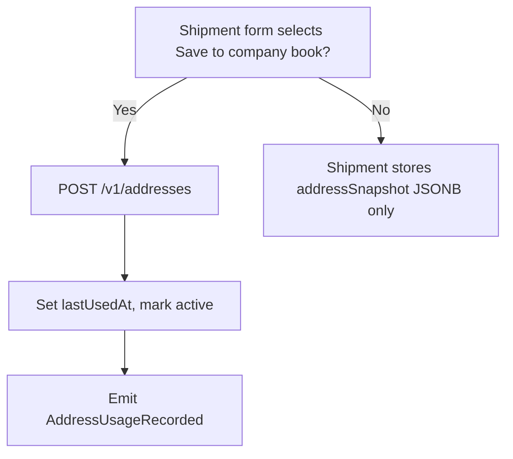
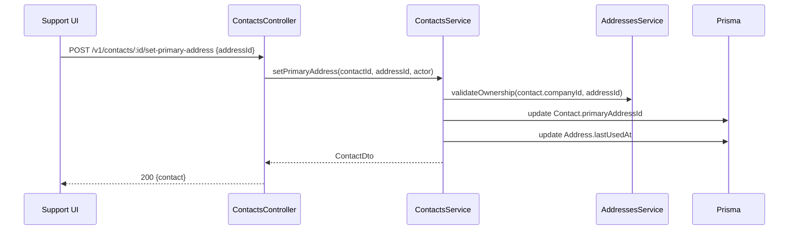

# Domain Architecture – Contacts & Addresses

> Applies ADR: 0001 (CUID identifiers), 0003 (human-readable references), 0004 (Prisma style guide), 0005 (AuthZ guardrails), 0006 (centralised config), 0007 (service guidelines), 0008 (legacy linkage).

## 1. Domain Overview
- Provides canonical company contact and address book capabilities for all downstream workflows (orders, fulfillment, invoicing).
- Contacts and addresses live exclusively in the new platform; no legacy mirroring (per business directive). Legacy ties stay limited to `company`, `asset`, `device`.
- Every `Company` row references a `CompanyMirror` so new records automatically inherit the legacy context when needed.
- Exposes reusable picker/search APIs for Support/Ops surfaces and service integrations (shipments, billing).

## 2. Responsibilities & Boundaries
- **Responsible:** CRUD lifecycle of contacts/addresses, role assignments, default selection, validation, deduping, usage metadata.
- Manage contact-specific addresses by allowing contacts to reference a primary address while reusing the shared address book.
- **Collaborators:** Orders (for billing contact/address linkage), Shipments (destination selection), Automation (notifications), Pricing (billing contact reference).
- **Out of scope:** Customer authentication, marketing contacts, legacy sync.

## 3. Data Model

- `reference` fields follow ADR 0003 (`ADDR-000123`) generated via sequence table (`address_sequences`).
- `Contact.primaryAddressId` optional; when present it must reference an address associated with the same company or an ad-hoc address created for that contact.
- Shared enums:
  - `ContactRoleEnum`: `BILLING`, `SHIPPING`, `OPERATIONS`, `TECHNICAL`, `EXECUTIVE`.
  - `AddressValidationStatus`: `OK`, `WARN`, `FAIL`, `UNKNOWN`.

## 4. Key Flows
### 4.1 Create Company Address

### 4.2 Apply Default Shipping/Billing
- Service ensures only one default per company; transaction updates chosen address and clears previous default flag.
- Emits `AddressDefaultChanged` event with `type` (`shipping`/`billing`) to notify subscriptions.

### 4.3 Save Ad-hoc Shipment Address

### 4.4 Assign Primary Address to Contact

## 5. API Surface
- `GET /v1/addresses` query params: `companyId`, `active`, `country`, `q`, pagination.
- `POST /v1/addresses` create (optionally with `setDefaultShipping`, `setDefaultBilling` flags).
- `PATCH /v1/addresses/:id` partial updates + validation status adjustments.
- `POST /v1/addresses/:id/archive` | `/activate`.
- `POST /v1/addresses/:id/set-default` body `{type: 'shipping' | 'billing'}`.
- `POST /v1/addresses/:id/validate` optional asynchronous validation hook (future EasyPost).
- `GET /v1/companies/:id/contacts`, `POST /v1/companies/:id/contacts`.
- `PATCH /v1/contacts/:id`, `POST /v1/contacts/:id/archive`.
- `POST /v1/contacts/:id/roles` body contains `roles: ContactRoleEnum[]`.
- `POST /v1/contacts/:id/set-primary-address` body `{addressId}` (optional null to clear); validates address belongs to company or is ad-hoc created for that contact.
- Search endpoints use text index across name/email/label for quick selection in UI.
- All endpoints annotated with `@Require` metadata per ADR 0005 (e.g., `@Require('contacts:create')`).

## 6. Integrations
- **Orders:** `Order` references `billingContactId`, `billingAddressId`. On order draft/checkout, service verifies contact belongs to company and is active.
- **Shipments:** `ShipmentService` consumes `AddressService.resolveForShipment` returning canonical address or snapshot builder.
- **Automation:** For notifications (emails/SMS) we resolve role-based contact lists via `ContactService.listByRoles(companyId, roles)`.
- **Contact-primary address linkage:** shipping workflows may pre-populate address pickers with a contact’s `primaryAddressId` when available.
- **Legacy bridge:** None; new data only. Legacy automation steps may require mapping to legacy device/asset but not to legacy contacts/addresses.
- **Domain Event Bus:** Contact/address mutations emit events (`ContactCreated`, `AddressDefaultChanged`, etc.) so other domains can react (e.g., refresh caches) in line with `domain-event-bus.md`.

## 7. Non-functional Requirements
- Adhere to Prisma style (ADR 0004): audit timestamps, snake_case mapping, enums.
- Sequence generation implemented via `SequenceService` using database sequences (fits ADR 0007 guidance: shared helper).
- Soft deletes everywhere (`active` flag). Archive endpoints check open usage (addresses used by active shipment) before deactivation.
- Address validation stub uses config-driven provider (ADR 0006) with toggles for sandbox vs production.
- Enforce referential integrity so `Contact.primaryAddressId` always references an address belonging to the same company (or an ad-hoc address marked to that contact).
- Controllers covered by e2e tests verifying authz (ADR 0005).

## 8. Open Considerations
- Internationalization of address fields (non-US region codes) – follow ISO-3166 as base.
- Potential integration with external validation provider (EasyPost) – queue job for asynchronous validation and update status when complete.
- Role expansion: design to add new enum values via migration; UI should gracefully hide unsupported roles from non-admin actors.
- **Contact primary addresses:** `ContactService.setPrimaryAddress(contactId, addressId)` validates ownership and updates both `primaryAddressId` and the address `lastUsedAt`.
