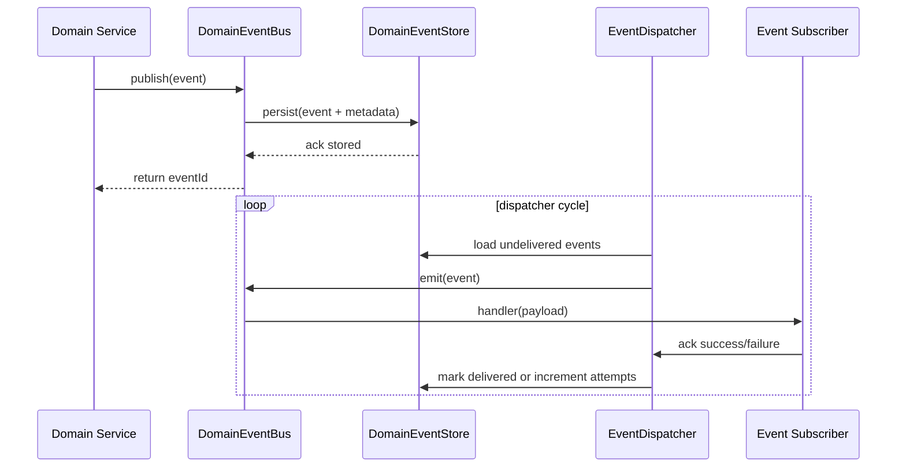

# Cross-Domain Event Bus Architecture

> Applies ADRs: 0001 (CUID IDs), 0004 (Prisma style guide), 0005 (authz guardrails), 0006 (config module), 0007 (service guidelines).

## 1. Purpose
- Provide a consistent way for domains to publish and react to significant business events without tight coupling.
- Power feature timelines, notifications, automation triggers, and analytics.
- Serve as a stepping stone towards an external message bus if scale demands it later.

## 2. Core Components
- **DomainEventBus (service):**
  - Wrapper around NestJS `EventEmitter2`.
  - Exposes `publish<T>(event: DomainEventPayload<T>)` and `subscribe(pattern, handler)`.
  - Enforces typed events using discriminated unions and helper factories.
- **DomainEventStore (Prisma):**
  - Table `DomainEvent` (`id`, `eventType`, `aggregateType`, `aggregateId`, `payload`, `metadata`, `occurredAt`, `createdAt`).
  - Persist every published event before emission (outbox pattern) to guarantee durability and replay.
  - `metadata` includes `actorId`, `correlationId`, `sourceModule`.
- **EventDispatcher (background worker):**
  - Polls the `DomainEvent` table for undelivered rows, emits them via `EventEmitter2`, and marks them as delivered (columns `deliveredAt`, `deliveryAttempts`).
  - Runs inside the API process or dedicated worker (configured via `AppConfigService`).
- **EventSubscribers:**
  - Each domain module registers handlers using `EventBusSubscriber` decorators or manual subscription in `onModuleInit`.
  - Handlers receive typed payload and can start transactions with the domain service as needed.

## 3. Event Lifecycle

- On handler failure, dispatcher retries with exponential backoff (configurable). After max attempts, event flagged `deadLetter=true` for manual inspection.
- Consumers should be idempotent; payload includes `eventId` and `occurredAt` to support dedupe.

## 4. Event Catalog & Consumers (Initial)
| Event | Publisher | Consumers |
| --- | --- | --- |
| `order.created` | OrdersService | Timeline writer, Analytics service |
| `order.checkout_sent` | OrdersService | Notification service (email customer link) |
| `order.payment_processing` | Payments webhook listener | Surface async payment progress in Support UI |
| `order.paid` | Payments webhook listener | Fulfillment orchestrator (create fulfillment), Billing (issue invoice), Timeline |
| `order.payment_failed` | Payments webhook listener | Support alerting, timeline annotations |
| `order.checkout_expired` | Payments webhook listener | Support follow-up to resend checkout |
| `FulfillmentCreated` | FulfillmentService | Ops dashboard metrics |
| `ShipmentDrafted` / `ShipmentReady` / `ShipmentInTransit` / `ShipmentDelivered` | ShipmentsService | Timeline, Automation queue (on delivered), Notification |
| `AutomationStepQueued` / `Succeeded` / `Failed` | AutomationWorker | Shipment timeline, Ops alerts |
| `InvoiceIssued` / `InvoicePartiallyPaid` / `InvoicePaid` / `InvoiceOverdue` / `InvoiceVoided` | BillingService | Notification, Accounting export |
| `PriceAgreementCreated` / `PriceAgreementUpdated` / `PriceAgreementSynced` / `PriceAgreementSyncFailed` | PriceAgreementService | Pricing resolver cache, Support alerts, analytics |
| `LegacySyncRequested` / `LegacySyncCompleted` | LegacyBridge | Support job monitor |

- Catalog maintained in `DomainEventCatalog` enum and referenced in each domain doc appendix.

## 5. API Exposure
- `GET /v1/events?aggregateType=&aggregateId=&cursor=` returns timeline for UI (leverages `DomainEvent` table).
- `GET /v1/events/:id` returns individual event and metadata.
- Consider caching aggregated timelines per entity (order→shipment events) for UI responsiveness.

## 6. Configuration & Ops
- `AppConfigService` exposes event bus options: `EVENT_BUS_DELIVERY_INTERVAL_MS`, `EVENT_BUS_MAX_ATTEMPTS`.
- `DomainEvent` table partitions by month (optional) to keep query performance.
- Metrics: `event_dispatch_latency`, `event_dispatch_failures_total`, `event_dead_letter_total`.
- Dead letter processing: CLI command or admin API to replay/inspect.

## 7. Future Evolution
- If event volume or fan-out grows, replace in-process dispatcher with external broker (Kafka, NATS). Domain APIs remain the same because `DomainEventBus` interface abstracts underlying transport.
- Introduce event versioning and schema registry as more services subscribe.
- Add at-least-once guarantee by leveraging transactional outbox (wrap event persistence with domain write inside single transaction).

## 8. Relationship to Domain-specific Audit Tables
- Individual domains persist scoped audit records (`order_events`, `product_events`, `shipment_events`, etc.) to optimize their timelines and UI queries.
- The shared `domain_events` table is the durable outbox for cross-domain workflows (automation, notifications, analytics).
- Services typically write to both: the domain-specific table for localized timelines and `domain_events` so other modules can subscribe without tight coupling.
