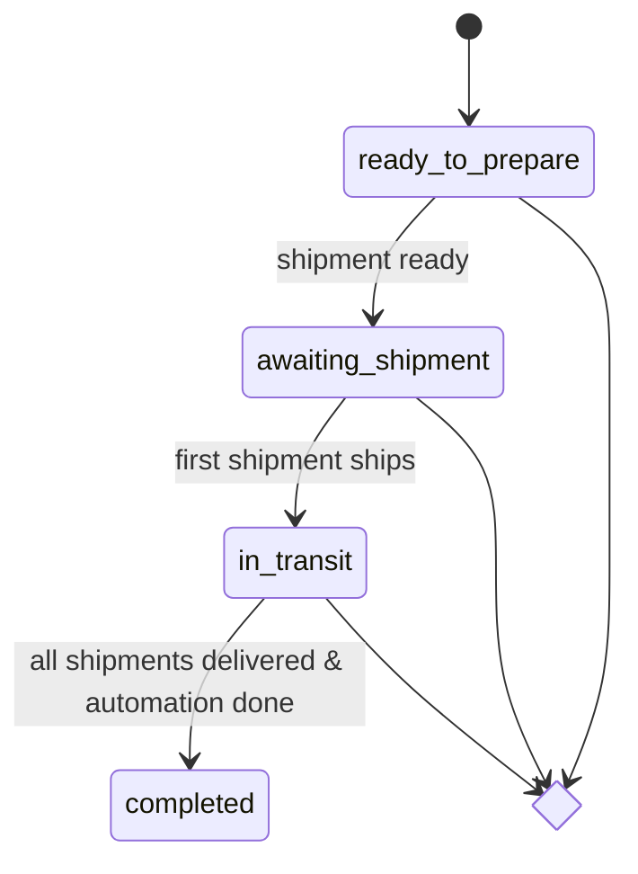
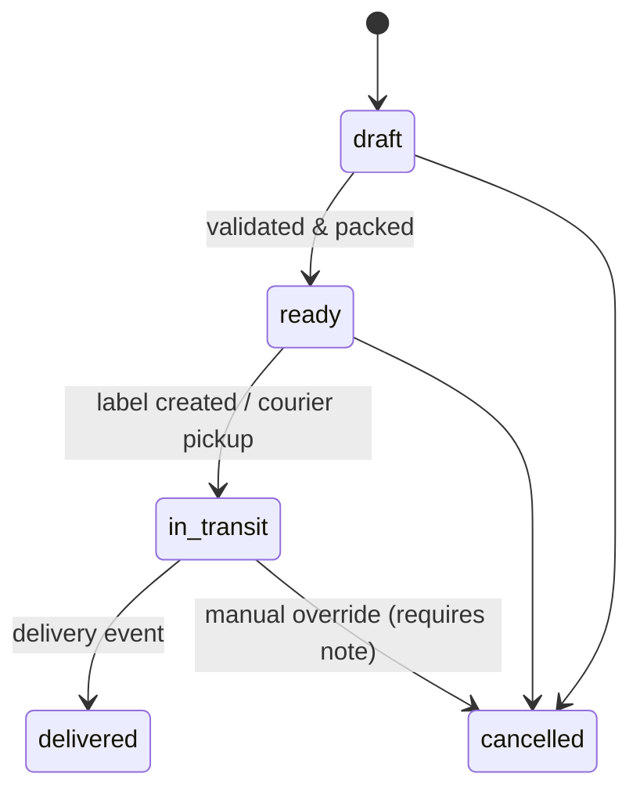
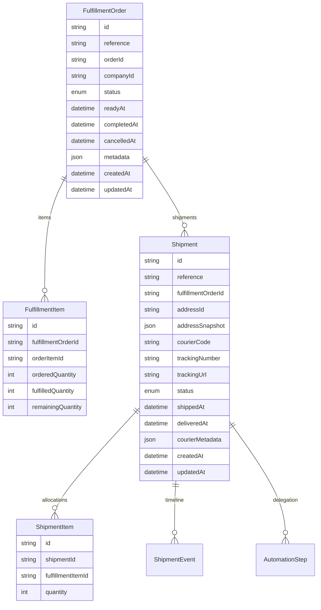
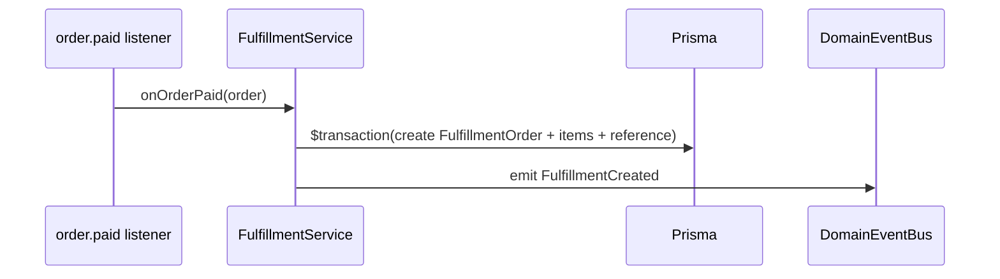
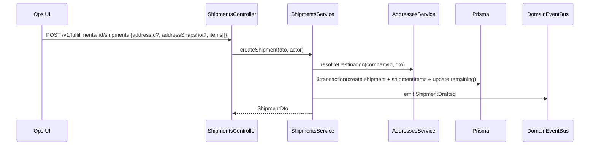

# Domain Architecture – Fulfillment & Shipments

> Aligns with ADRs: 0001 (CUID), 0003 (human-readable references), 0004 (Prisma style), 0005 (authz), 0006 (config), 0007 (service patterns), 0008 (legacy linkage). Builds on `sensor-hardware-orders` specs.

## 1. Domain Purpose
- Translate paid orders into operational workflows: allocation, shipment assembly, courier tracking, delivery confirmation.
- Support multi-destination shipments per order and granular status tracking for Support/Ops dashboards.
- Provide data foundation for automation triggers post-delivery.

## 2. Responsibilities & Interfaces
- **Owns:** Fulfillment orders, shipment lifecycle, allocation of quantities, courier metadata, shipment timelines.
- **Collaborates:** Orders (input data), Contacts/Addresses (destination selection), Automation domain (execution triggers), Legacy bridge (post-delivery updates), Tracking integrations.

## 3. State Machines
### Fulfillment Order

### Shipment

## 4. Data Model

- References follow ADR 0003 pattern (`FUL-000123`, `SHIP-000456`).
- `courierCode` seeded values: `USPS`, `DHL`, `CHITCHAT`, `CANADAPOST`; more rows can be added without schema changes.
- `ShipmentEvent` stores both courier events (webhook/poller) and business actions (status transitions, manual notes).

## 5. Core Flows
### 5.1 Fulfillment Creation

- Triggered by the `order.paid` domain event once checkout succeeds.

### 5.2 Shipment Assembly

### 5.3 Courier Tracking & Delivery
- Tracking adapter polls webhooks (per courier). On event, convert to internal schema, save `ShipmentEvent`, update status if milestone reached (in_transit/delivered), emit domain events.
- Delivery event triggers automation queue job (`AutomationProcessor.enqueue(shipmentId)`).

### 5.4 Fulfillment Status Recalculation
- Every shipment status transition runs inside a transaction that:
  - Persists the shipment event and adjusts fulfilled / remaining quantities (cancels return inventory to available stock).
  - Recomputes the parent `FulfillmentOrder` status based on `remainingQuantity` sums and current shipment states:
    - Any `IN_TRANSIT` shipment → fulfillment `IN_TRANSIT`.
    - All quantities allocated, at least one shipment `READY`/`DRAFT` → `AWAITING_SHIPMENT`.
    - All shipments delivered and no remaining quantity → `COMPLETED` (records `completedAt`).
    - Otherwise fall back to `READY_TO_PREPARE`.
- When the fulfillment status changes the service emits:
  - `fulfillment.status_updated` (domain event + order timeline record).
  - `fulfillment.completed` once the order is fully delivered (used by automation/billing listeners).

## 6. API Surface
- `GET /v1/fulfillments` with filters (`status`, `companyId`).
- `GET /v1/fulfillments/:id` – includes items, shipments, remaining quantities.
- `PATCH /v1/fulfillments/:id/status` – limited to `cancelled` transitions with guard rails.
- `POST /v1/fulfillments/:id/shipments` create shipment.
- `PATCH /v1/shipments/:id` – update courier, notes, manual status adjustments.
- `POST /v1/shipments/:id/status` – transitions (ready, in_transit, delivered, cancelled) with validation.
- `GET /v1/shipments/:id/events` – timeline.
- `POST /v1/shipments/:id/track` – manual trigger to refresh courier status (optional).
- All endpoints guarded by `@Require('fulfillment:*')` policies (ADR 0005).

## 7. Integrations
- **Orders Domain:** receives `FulfillmentSummary` for UI; order detail page uses shipments data for progress.
- **Contacts/Addresses:** ensures address belongs to company when `addressId` provided; snapshot stored for auditing.
- **Automation:** receives `ShipmentDelivered` event with shipment + item context.
- **Legacy Bridge:** automation steps may call `LegacyDeviceService` / `LegacyAssetService` with data from shipments.
- **Async Jobs:** `ShipmentTrackingWorker` polls for outstanding shipments (BullMQ).
- **Domain Event Bus:** Fulfillment/Shipment events published through `DomainEventBus` to drive timelines, automation triggers, and analytics subscribers (`domain-event-bus.md`).

## 8. Non-functional Requirements
- Transactions enforce quantity constraints (`remainingQuantity >= 0`). Use `SELECT ... FOR UPDATE` via Prisma `$transaction` to prevent double allocation.
- Sequence enforcement for references uses same `SequenceService`.
- Courier config stored in table `Courier` with `code`, `name`, `trackingUrlTemplate`, `webhookSecret?`, `supportsWebhooks`.
- Observability: metrics for SLA (order paid → shipped, shipped → delivered), backlog of shipments per status, courier failure counts.
- E2E tests ensure partial shipments scenario works (different addresses).

## 9. Future Considerations
- Add package contents metadata (`weight`, `dimensions`) once required for rate shopping.
- Hook in label generation providers (e.g., EasyPost) with plugin architecture using `CourierAdapter` interface.
- International compliance: capture customs info for cross-border shipments (Canada Post, DHL).
