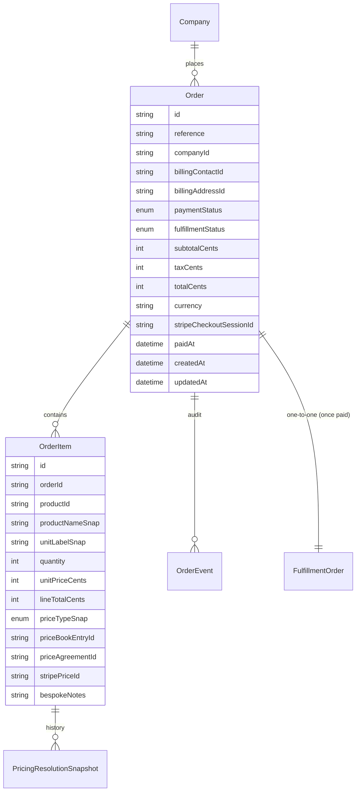
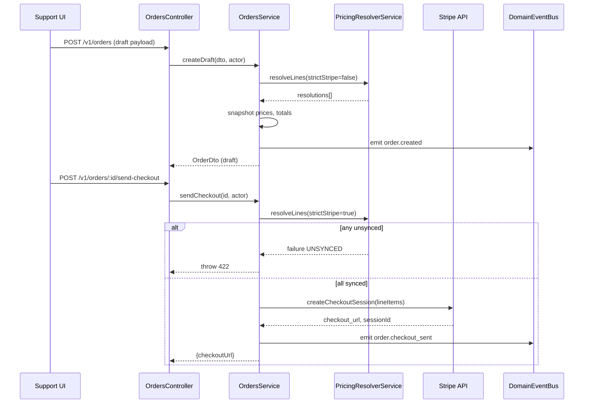

# Domain Architecture – Orders & Pricing Integration

> Applies ADRs: 0001 (CUID IDs), 0003 (external references), 0004 (Prisma style), 0005 (auth), 0006 (config), 0007 (service guidelines), 0008 (legacy linkage). Respects `pricebook` specs and future `price agreements`.
>
> Product specs: [Price Book – Core](../specs/pricebook/pricebook.md), [Price Book – Extended](../specs/pricebook/pricebook-extended.md), [Unsynced Price Guardrails](../specs/pricebook/pricebook-unsynced-prices.md)

## 1. Domain Vision
- Offer a resilient order lifecycle for hardware and future services with strict pricing provenance.
- Orders are the business nucleus triggering fulfillment, billing, and automation.
- Pricing resolution must be deterministic, auditable, and Stripe-aligned (`strictStripe` enforcement).

## 2. Responsibilities & Boundaries
- **Owns:** Order creation, status management, payment orchestration (via Stripe checkout session), item price snapshots, totals, timeline events.
- **Collaborates:** Pricing resolver (Price Book + agreements), Payments integration (Stripe), Fulfillment domain, Automation events, Support UI.
- **Excludes:** Inventory management, shipping logistics (handled by fulfillment/shipments), customer invoicing (future domain).
- Assumes every `Order` references a `Company` that already wraps its `CompanyMirror`, so legacy context is always available without hitting mirrors directly from this domain.

## 3. Data Model

- Human-friendly references: `ORD-000123` generated via shared `SequenceService`.
- `OrderEvent` stores domain event payloads (type, actorId, metadata).
- `PricingResolutionSnapshot` retains resolver metadata when re-evaluations occur (e.g., during checkout or manual overrides).

## 4. Key Flows
### 4.1 Order Draft & Checkout

### 4.2 Payment Webhook → Fulfillment
- `PaymentsModule` hosts the Stripe-facing service and webhook controller. When `sendCheckout` runs it delegates session creation to `PaymentsService`, which supports live mode (Stripe API) and mock mode when keys are absent.
- Stripe webhooks (`/v1/webhooks/stripe`) are verified via signature in live mode. `checkout.session.completed`, `payment_intent.succeeded`, `payment_intent.payment_failed`, and `checkout.session.expired` update the order state inside a Prisma transaction.
- Emits domain events matching the internal naming convention: `order.payment_processing` (for async intents), `order.paid`, `order.payment_failed`, and `order.checkout_expired`. These feed the fulfillment orchestrator and billing listeners.
- All writes occur inside Prisma transactions, abiding by ADR 0007 guidance.

## 5. Pricing Resolver Contract
- Input per line: `{companyId?, productId, qty, currency, region?, strictStripe, effectiveAt?}`.
- Resolution priority: `PriceAgreement` (when available) → regional `PriceBookEntry` → global entry.
- Output: `{unitAmount, source, priceBookEntryId?, priceAgreementId?, stripePriceId?, syncStatus, label}`.
- Resolver logs invocation in `PricingResolutionSnapshot` with hash to compare subsequent evaluations.
- Configuration (ADR 0006) controls fallback behaviours and Stripe account keys.

## 6. API Surface
- `POST /v1/orders` – create draft order.
- `GET /v1/orders` – filters by company, payment status, fulfillment status, and returns aggregated shipment & invoice summary for Support dashboards.
- `GET /v1/orders/:id` – full detail (items, shipments summary, timeline).
- `PATCH /v1/orders/:id` – limited edits while in `draft`/`pending_payment`.
- `POST /v1/orders/:id/send-checkout` – triggers Stripe session creation.
  - Re-runs the pricing resolver with `strictStripe=true`, updates item snapshots if values change, refreshes order totals, then calls `PaymentsService` to create the Stripe Checkout session. Publishes `order.checkout_sent` regardless of mock/live mode.
- `POST /v1/orders/:id/cancel` – guard by status (cannot cancel after fulfillment in progress without override).
- Webhooks: `/v1/webhooks/stripe` handles `checkout.session.completed`, `payment_intent.payment_failed`.
- `POST /v1/pricing/quote` – batch quoting for UI wizard (strict optional).

AuthZ policies per ADR 0005: e.g., `orders:create`, `orders:read`, `orders:checkout`.

## 7. Integrations
- **Fulfillment Module:** consumes `order.paid` events, reads order items for initial allocation data.
- **Shipments:** summary endpoint uses order data to show outstanding quantities.
- **Pricing Domain:** price agreements (`domain-price-agreements.md`) feed the resolver before price book entries; service exposes agreement queries and sync status for checkout enforcement.
- **Notifications:** domain events feed timeline UI and optional Slack/email notifications.
- **Billing/Invoicing:** `order.paid` listener invokes Billing domain to generate invoices; order detail surfaces invoice references and outstanding balances. Future staged billing may emit invoice events based on fulfillment milestones.
- **Domain Event Bus:** All emitted events (`order.created`, `order.checkout_sent`, `order.payment_processing`, `order.paid`, `order.payment_failed`, `order.checkout_expired`) go through `DomainEventBus` (see `domain-event-bus.md`) to ensure durable publication and consistent subscriber handling.

## 8. Non-functional Considerations
- All Prisma models follow ADR 0004 (CUID IDs, audit timestamps, snake_case mapping).
- Sequence generator ensures gapless references even under concurrency (use DB sequence).
- Stripe keys loaded via `AppConfigService` (ADR 0006) with environment validation.
- Unit tests cover resolver selection logic; integration tests simulate draft→checkout→webhook→fulfillment.
- OrdersService exposes typed DTOs, controllers remain thin (ADR 0007).

## 9. Future Enhancements & Open Questions
- Implement manual invoice path (non-Stripe) once Finance requirements clarified.
- Support order amendments post-payment (create adjustment orders?).
- Extend resolver caching layer (Redis) if quoting volume spikes.
- Add customer-facing order status endpoints (once external portal planned).
