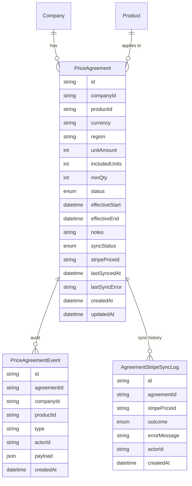
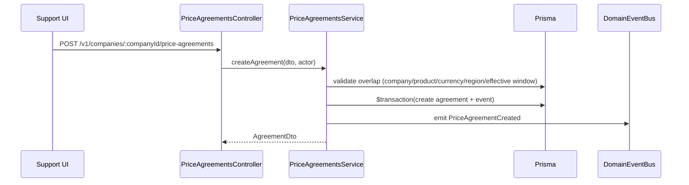
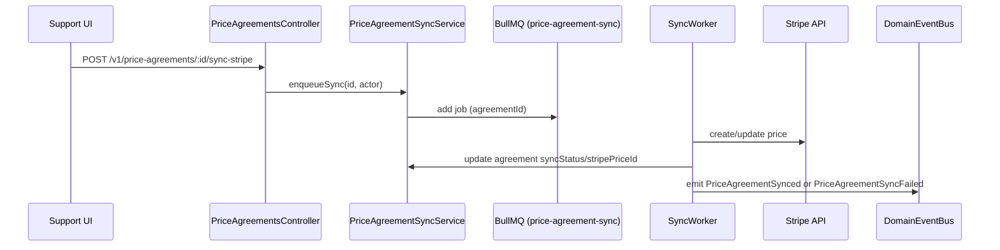

# Domain Architecture – Price Agreements

> Aligns with ADRs: 0001 (CUID identifiers), 0003 (human-readable references), 0004 (Prisma style guide), 0005 (authorization), 0006 (config), 0007 (service guidelines). Extends `pricebook` and `pricebook-extended` specs.

## 1. Purpose
- Support negotiated pricing for specific companies (single-use or time-bound contracts) while preserving deterministic price resolution.
- Provide tooling for Sales/Support to create, manage, and sync agreements to Stripe.
- Feed the shared `PricingResolverService` so orders, quotes, and invoices reference the correct price source.

## 2. Scope & Boundaries
- **Owns:** Agreement lifecycle (create, activate/deactivate, effective windows, min quantity), sync state with Stripe, audit history, resolver integration.
- **Collaborates:** Price Book domain (fallback prices), Orders/Pricing (resolver consumption), Billing/Invoices (price provenance), Stripe sync module, Support UI.
- **Out of scope:** Subscription contracts, multi-product bundles (future considerations).

## 3. Data Model

- Enums:
  - `PriceAgreementStatus`: `active`, `inactive`, `archived`.
  - `AgreementSyncStatus`: `unsynced`, `synced`, `failed`.
  - `AgreementEventType`: `CREATED`, `UPDATED`, `DEACTIVATED`, `SYNC_STARTED`, `SYNC_SUCCESS`, `SYNC_FAILED`.
- Optional fields: `region` (null = global), `minQty` (null = no threshold), `includedUnits` default 1.

## 4. Key Flows
### 4.1 Create Agreement

- Optionally allow `saveAndSync=true` to queue Stripe sync immediately.

### 4.2 Stripe Sync

- Reuse shared BullMQ infrastructure (`domain-automation-async.md`).

### 4.3 Resolver Consumption
- `PricingResolverService` queries active agreements using:
  - `companyId`, `productId`, `currency`, `region` (exact match or null), `minQty <= qty`, `effectiveStart <= date`, `effectiveEnd >= date OR null`.
  - Sort by specificity (region > null), higher `minQty`, most recent `updatedAt`.
- When `strictStripe=true`, enforce `syncStatus='synced'` and presence of `stripePriceId`.
- Resolution returns `{source: 'PRICE_AGREEMENT', priceAgreementId, stripePriceId, unitAmount, syncStatus}`.

## 5. API Surface
- `GET /v1/companies/:companyId/price-agreements` – filters: `productId`, `currency`, `status`, `syncStatus`, pagination.
- `POST /v1/companies/:companyId/price-agreements`.
- `PATCH /v1/price-agreements/:id` – updates financial fields, effective windows, notes.
- `POST /v1/price-agreements/:id/deactivate` / `/activate`.
- `POST /v1/price-agreements/:id/sync-stripe`.
- `GET /v1/price-agreements/:id/history` – returns `PriceAgreementEvent` timeline.
- `GET /v1/price-agreements/:id` – detail including sync logs.
- Authorization via `@Require('price-agreements:*')` policies.

## 6. UI & Operational Surfaces
- **Price Book – Agreements Tab:** Table grouped by company, columns per spec (currency, region, min qty, status, sync).
- **Company Profile – Pricing Tab:** Shows agreements specific to company; CTA to create new agreement with product picker.
- **Stripe Sync Dashboard:** aggregated counts of unsynced/failed agreements, quick actions.
- **Notifications:** On sync failure, raise banner/toast with error detail and link to logs.

## 7. Integration Points
- **Orders/Pricing:** Resolver uses agreements before price book entries. Order items store `priceAgreementId` in snapshot for audit, invoices reuse same reference.
- **Billing:** Invoices reference agreement info in line item metadata for reporting.
- **Event Bus:** Publish events (`PriceAgreementCreated`, `PriceAgreementUpdated`, `PriceAgreementSynced`, `PriceAgreementSyncFailed`). Consumers include timeline builder, analytics, and alerting.
- **Automation/Async:** Sync jobs tracked via `JobRun` infrastructure (queue `price-agreement-sync`) for Support monitoring.
- **Config:** Stripe account and queue options read via `AppConfigService`.

## 8. Non-functional Requirements
- Overlap enforcement: service validates there isn’t another active agreement overlapping same `(companyId, productId, currency, region)` window (respects `minQty` gating). Use transaction with `SELECT ... FOR UPDATE` to prevent race.
- Audit logging: every mutation writes `PriceAgreementEvent` with diff payloads; order resolver logs include agreement ID.
- Testing: unit tests for overlap resolution, resolver priority, sync failure handling; integration tests for quote endpoint with agreements.
- Metrics: `price_agreement_sync_success_total`, `price_agreement_sync_failed_total`, `price_agreement_active_count`.
- Default values: `status=active`, `syncStatus=unsynced`, `includedUnits=1`.
- Support for future bulk import via CSV/API – ensure service can handle batched operations.

## 9. Roadmap
- **Phase 1 (schema & CRUD):** Implement agreement models, API, UI surfaces, integrate resolver with non-strict path.
- **Phase 2 (Stripe sync):** Queue-based sync, logs, failure handling, Support monitoring.
- **Phase 3 (Strict enforcement):** Gate checkout with `strictStripe` requiring synced agreements; update notifications for unsynced agreements in pipeline.
- **Phase 4 (Advanced features):** Quantity tiers beyond single threshold, regional overrides, reporting exports.

