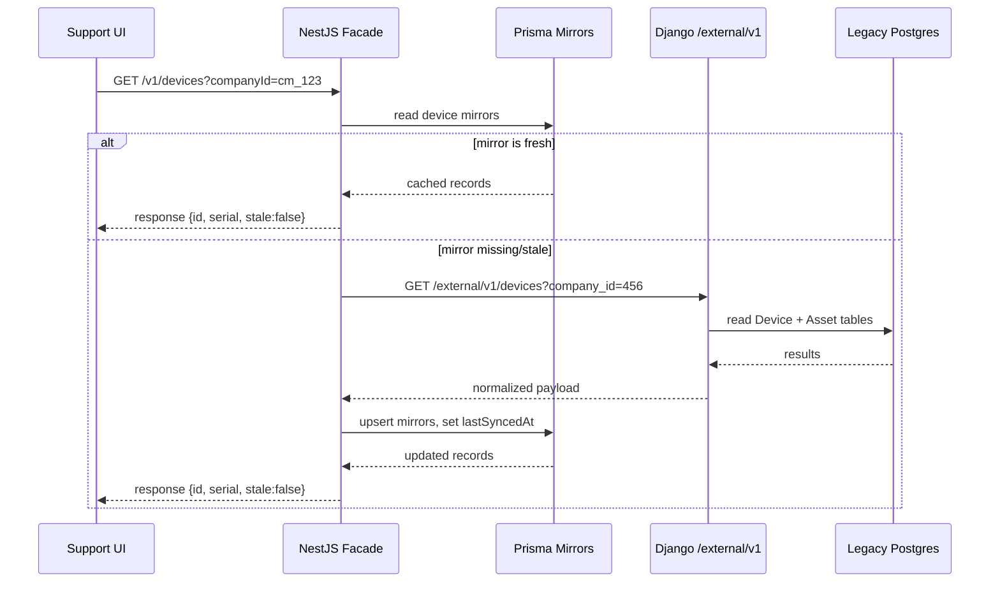

# Legacy Integration Bridge

This document captures how the new NestJS app (`app-api`) talks to the existing Django system (`mobilytics-api`) to provide a stable interface for the Support tooling while we keep migrating domains away from the legacy stack.

---

## Components

- **NestJS facade (`app-api`)**
  - Prisma models `CompanyMirror`, `DeviceMirror`, `AssetMirror` hold the trusted subset of legacy data the Support app consumes (cuid primary keys + `legacy*Id`). Modern `Company` rows reference their mirror via `companyMirrorId`, ensuring any downstream feature automatically has access to the legacy snapshot when required.
  - Modern device/asset modules (`Device`, `Asset`, `DeviceAssignment`) are being introduced alongside the mirrors. They treat Nest’s Postgres database as the source of truth for current ownership and assignment history while the legacy bridge acts as a downstream replication target.
  - `LegacyHttpClient` (`src/integrations/legacy/legacy-http.client.ts`) wraps Axios with API-key auth, timeouts, retry, and a simple circuit breaker.
  - `/v1/companies`, `/v1/devices`, `/v1/assets` modules expose read-through endpoints that hydrate the mirrors on-demand and set `stale` flags when legacy calls fail.
  - DTOs surface only safe fields (IDs, labels, timestamps) plus metadata such as `assignmentObservedAt` so the UI knows whether an assignment was recently verified.

- **Django external API (`mobilytics-api`)**
  - New router `api/routers/external_integrations.py` exposes `/external/v1/companies`, `/external/v1/devices`, `/external/v1/assets` via the existing Ninja `external_api_v1` instance.
  - Authenticated through the v5 API key header (`Authorization: Bearer <token>`). Any Nest consumer must provision a token in the legacy DB (`authtoken_token`).
  - Responses return only the fields the Nest mirrors consume, with weak ETags (`W/"<kind>:<id>:<timestamp>"`) and `assignment_observed_at` proxies derived from `modified_at` values.

- **Data stores**
  - Postgres (Nest) — owns mirror tables and all future-first data (orders, etc.), plus the new `Device`, `Asset`, and `DeviceAssignment` tables that record authoritative state and history. These tables are driven via Prisma migrations.
  - Postgres (Django) — remains the operational store for legacy companies/devices/assets until replacement modules are built.

---

## Request Flow

- If the legacy call fails, Nest serves the last cached mirror and sets `stale: true` so the UI can surface a warning.
- `assignmentObservedAt` is derived from the most recent `modified_at` timestamp on the legacy record (device or asset). Once the modern assignment service is live, the field will be sourced from `DeviceAssignment.startsAt/endsAt` events and legacy timestamps become a fallback only.

---

## Sync & TTL Strategy

| Entity   | TTL       | Refresh triggers                                    |
|----------|-----------|-----------------------------------------------------|
| Company  | 24 hours  | Automatic on GET when stale; nightly cron (todo).  |
| Device   | 1 hour    | GET/refresh POST, manual refresh in UI, nightly cron. |
| Asset    | 1 hour    | Same as devices.                                    |

Additional notes:

- `/v1/devices/refresh` and `/v1/assets/refresh` accept legacy ID lists for manual re-syncs when Ops needs the freshest details.
- A future job (Temporal/cron or Nest scheduler) will iterate through active mirrors nightly to pre-warm the cache and detect assignment drift.

---

## Modern Device & Asset Ownership

- The modernization effort promotes Nest to the system of record for device and asset lifecycle. New Prisma models:
  - `Device` (modern id, serial, hardware metadata, `deviceMirrorId?`).
  - `Asset` (modern id, company ownership, attributes, `assetMirrorId?`).
  - `DeviceAssignment` (CUID primary key, `deviceId`, `companyId`, `assetId?`, `startsAt`, `endsAt?`, `source`, `notes`). Assignments are non-overlapping per device and capture the full audit trail of which customer or asset held a device at any point in time.
- Write path for automation scenarios and Support tooling:
  1. Persist/update `Device`/`Asset` rows as needed (create missing entities, patch metadata).
  2. Create or close `DeviceAssignment` windows reflecting the action (lease start, swap, return).
  3. Emit `DeviceAssignmentCreated/Ended` domain events so timelines and analytics stay in sync.
  4. Invoke `LegacyBridgeService` to mirror the assignment or swap in Django using the same automation id as an idempotency key.
- Legacy mirrors remain in place for compatibility but transition to read-mostly: any modern write marks the mirror `stale` so an asynchronous reconciliation job can confirm legacy parity.
- Historical data bootstrap:
  - Import legacy assignment history into `DeviceAssignment` with `source='legacy_import'` and a `dataReliability='legacy_snapshot'` flag so UI/API can differentiate authoritative vs. informational timeline entries.
  - Gaps or conflicting windows detected during import are logged and surfaced in Support dashboards for manual review.
- API surface adjusts accordingly: `/v1/devices` and `/v1/assets` begin returning modern structures with an embedded `currentAssignment` and `history` summaries (paginated). Backward-compatible mirror fields remain until clients upgrade.
- Automation, fulfillment, and Support UIs must call the modern services first; the legacy bridge is only contacted to maintain downstream parity until the legacy stack is decommissioned.

---

### Modern API Surface (NestJS)

| Method | Path | Description |
| --- | --- | --- |
| `POST` | `/v1/device-assignments` | Creates or resumes a device assignment. Accepts either modern CUIDs or legacy identifiers for devices, companies, and assets. Returns the persisted assignment plus the latest timeline for the device. |
| `POST` | `/v1/device-assignments/replace` | Convenience endpoint used by automation to swap devices in one call. Closes the active assignment on the source device, creates a new assignment on the target, and returns both records alongside refreshed timeline data. |
| `POST` | `/v1/device-assignments/:deviceIdentifier/close` | Closes the active assignment (if present) and returns the updated device timeline. Optional payload fields allow back-dating and annotating the closure. |
| `GET` | `/v1/device-assignments/history` | Lists assignment history for a device (default 20 most recent). Supports optional `includeClosed` and `limit` parameters. |

Additional notes:

- Identifiers may be supplied as the modern CUID or the legacy id; the controller resolves and normalises them through `DeviceAssignmentService`.
- Responses expose the canonical assignment view (`device`, `company`, optional `asset`, timestamps, source, reliability, notes) to keep Support tooling and automation logs consistent.
- The `legacy-sync.integration.spec.ts` harness exercises create → reassign → close flows via these endpoints and asserts that `/v1/devices` reflects the expected `currentAssignment` state throughout.

### Legacy External API Surface (Django)

The existing Ninja router remains read-only and backs the mirror refresh jobs. Endpoints share the API-key gate (`Authorization: Bearer <token>`), return weak ETags, and shape responses to match the mirror schema.

| Method | Path | Description |
| --- | --- | --- |
| `GET` | `/external/v1/companies` | List companies with optional filters (`q`, `ids`, pagination). |
| `GET` | `/external/v1/companies/{id}` | Fetch a single company by legacy id. |
| `GET` | `/external/v1/devices` | List devices with optional company/id/query filters; omits retired hardware. |
| `GET` | `/external/v1/devices/{device_id}` | Retrieve a device by legacy id. |
| `POST` | `/external/v1/devices/introspect` | Batch lookup of devices by legacy id (used by `/v1/devices/refresh`). |
| `GET` | `/external/v1/assets` | List active assets with optional company/id/query filters. |
| `GET` | `/external/v1/assets/{id}` | Retrieve an asset by legacy id. |

These routes remain the source for mirror hydration until the modern API becomes the single source of truth for legacy consumers. Future work (tracked in the roadmap) is to promote write endpoints so the Nest layer can push assignment changes back into Django without reusing the brittle JSON payload approach.

---

## Error Handling

- Legacy HTTP failures bubble up as typed `LegacyRequestError`s (timeout, rate-limit, circuit-open, etc.). Controllers translate them into structured API responses while preserving cached data.
- The Django router returns `404` for missing resources and weak ETags in successful responses; 5xx/4xx errors are normalized by the Ninja exception handlers into `{"error": "..."}` payloads.
- Circuit breaker defaults (configurable via env vars): threshold `5` failures, cooldown `30s`, retry delay `250ms` with up to `2` retries.

---

## Deployment & Configuration

| Service | Key env vars |
|---------|--------------|
| Nest    | `LEGACY_API_BASE_URL`, `LEGACY_API_KEY`, timeout/retry/circuit settings. |
| Django  | Create API token (`python manage.py drf_create_token <user>`) or insert via admin. Ensure `external_api_v1` URL is exposed (`/external/v1/`). |

Both services require their usual Postgres connections (`DATABASE_URL` for Nest, `POSTGRES_*` for Django). Make sure migrations are applied after pulling these changes.

---

## Testing

- Jest/TS: run `pnpm --filter @mobilytics/app-api typecheck` and `pnpm --filter @mobilytics/app-api lint` (already clean).
- Python: with valid `POSTGRES_*` settings, run `venv/bin/python -m pytest tests/api/test_external_integrations.py` to exercise the new `/external/v1` routes.

---

## Future Enhancements

- Add a scheduled reconciliation job that pre-refreshes mirrors, compares results against modern `DeviceAssignment` state, and logs drift.
- Build the legacy history importer + conflict detector, surfacing any gaps in Support dashboards for manual resolution.
- Expand test coverage for pagination/filters and error cases (429, 5xx) using mocked legacy responses on the Nest side, and add contract tests that ensure modern `Device`/`Asset` APIs round-trip the same data to Support UI clients.
- Addresses and contacts remain new-platform only; future reconciliation jobs should continue to ignore those entities even as devices/assets migrate fully.
- Surface mirror refresh, assignment imports, and automation-driven sync jobs through the shared `JobRun` monitoring endpoints so Support can observe status without direct Redis access.
