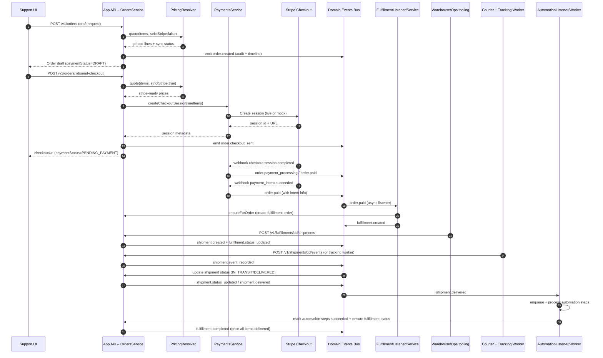

# Order Fulfillment Critical Path

> Complements: [Domain – Orders & Pricing](./domain-orders-pricing.md), [Domain – Fulfillment & Shipments](./domain-fulfillment-shipments.md), [Domain Event Bus](./domain-event-bus.md). Source of truth for the end-to-end hardware order experience (draft → payment → fulfillment → delivery → automation).

The critical path strings together pricing resolution, payment orchestration, fulfillment, shipping, and downstream automation. The diagrams and notes below highlight the systems involved, the events emitted, and the state transitions relied upon during a successful run.

## 1. Critical Path Overview

```mermaid
flowchart LR
    A["Support Agent<br/>Backoffice UI"] -->|POST /v1/orders| B(OrdersService<br/>createDraft)
    B -->|quote items| C[(PricingResolverService)]
    C --> D["Order Draft<br/>paymentStatus=DRAFT"]
    D -->|POST /v1/orders/:id/send-checkout| E(OrdersService<br/>sendCheckout)
    E -->|strictStripe quote| C
    E -->|line items| F(PaymentsService<br/>createCheckoutSession)
    F -->|session| G{Stripe Checkout}
    G -->|checkout.session.completed<br/>payment_intent.succeeded| H(PaymentsService<br/>webhook handler)
    H -->|order.paid| I[Domain Event Bus]
    I -->|order.paid| J(FulfillmentListener<br/>ensureForOrder)
    J --> K["Fulfillment Order<br/>status=READY_TO_PREPARE"]
    K -->|POST /v1/fulfillments/:id/shipments| L(ShipmentsService<br/>createShipment)
    L --> M["Shipment(s)<br/>status: READY → IN_TRANSIT"]
    M -->|tracking jobs| N[Tracking Worker<br/>BullMQ]
    N -->|shipment.event_recorded<br/>shipment.delivered| I
    I -->|shipment.delivered| O(AutomationListener<br/>enqueue steps)
    O --> P[Automation Worker<br/>BullMQ]
    P -->|automation.step_succeeded<br/>automation.shipment_completed| I
    P -->|ensure statuses| Q(ShipmentsService<br/>ensureFulfillmentStatus)
    Q --> R["Fulfillment status updated<br/>COMPLETED → order fulfilled"]
```

## 2. Interaction Timeline

## 3. Stage Details

### 3.1 Order Draft & Pricing
- `POST /v1/orders` (`OrdersService.createDraft`) validates company, address, and contact ownership, then calls `PricingResolverService.quote` for any lines missing an explicit unit price.
- Pricing responses are snapshot into `PricingResolutionSnapshot` and stored with each `OrderItem`. Unsynced lines block downstream checkout when `strictStripe` is later required.
- Domain artifacts: `order.created` event, `OrderPaymentStatus = DRAFT`, timeline entry via `OrderEventsService`.
- Key files: `apps/app-api/src/orders/orders.service.ts:108` (pricing quote logic) and `apps/app-api/src/pricing/pricing.service.ts`.

### 3.2 Checkout & Payment Orchestration
- `POST /v1/orders/:id/send-checkout` replays pricing with `strictStripe=true` to guarantee Stripe price IDs for every line.
- `PaymentsService.createCheckoutSession` (`apps/app-api/src/payments/payments.service.ts:74`) either hits Stripe (live) or generates a mock session (test/local), embedding `orderId`, `orderReference`, and `companyId` in metadata.
- Order totals are refreshed; payment status transitions `DRAFT → PENDING_PAYMENT`. Domain events: `order.checkout_sent`.
- Stripe webhooks (`/v1/webhooks/stripe`) update order status and paid timestamps:
  - `checkout.session.completed` → `order.payment_processing` or `order.paid`.
  - `payment_intent.succeeded` → `order.paid` (ensures invoices are marked).
  - `payment_intent.payment_failed` → `order.payment_failed`.

### 3.3 Fulfillment Orchestration
- `FulfillmentListener` (`apps/app-api/src/fulfillment/fulfillment.listener.ts:24`) listens for `order.paid` and invokes `FulfillmentService.ensureForOrder`.
- A fulfillment order (`FUL-* reference`) is created with one fulfillment line per paid order item, default status `READY_TO_PREPARE`. Domain event: `fulfillment.created`.
- Support dashboards surface the new fulfillment for operations teams to act on.

### 3.4 Shipment Execution & Tracking
- Ops create shipments via `POST /v1/fulfillments/:id/shipments` (`ShipmentsService.createShipment`, `apps/app-api/src/shipments/shipments.service.ts:88`), selecting fulfillment item quantities and courier.
- Shipments start in `READY`, expect tracking details via `PATCH /v1/shipments/:id/tracking`.
- Tracking updates arrive either manually (`POST /v1/shipments/:id/events`) or through scheduled tracking ingestion (`TrackingWorker`, `apps/app-api/src/tracking/tracking.worker.ts`). Courier events set `isCourierEvent=true` and can advance status to `IN_TRANSIT` or `DELIVERED`.
- Domain events: `shipment.created`, `shipment.event_recorded`, `shipment.status_updated`, `shipment.delivered`. Fulfillment statuses progress `READY_TO_PREPARE → AWAITING_SHIPMENT → IN_TRANSIT → COMPLETED` as shipments cover all ordered quantities.

### 3.5 Automation Follow-Up
- `AutomationListener` (`apps/app-api/src/automation/automation.listener.ts`) reacts to `shipment.delivered`, locating pending automation steps (e.g., sensor activation, returns).
- Jobs are queued through BullMQ (`AutomationQueue`) and processed by `AutomationWorker` (`apps/app-api/src/automation/automation.worker.ts`). Successful runs emit `automation.step_succeeded` and `automation.shipment_completed`.
- Post-processing calls `ShipmentsService.ensureFulfillmentStatus` to re-evaluate fulfillment completeness and keep order-level fulfillment status in sync.

## 4. Status & Event Summary

| Stage | Primary Status Transitions | Key Domain Events | External Systems |
| --- | --- | --- | --- |
| Order draft | `OrderPaymentStatus: DRAFT` | `order.created` | Pricing Resolver |
| Checkout sent | `DRAFT → PENDING_PAYMENT` | `order.checkout_sent` | Stripe Checkout |
| Payment settled | `PENDING_PAYMENT → PAYMENT_PROCESSING → PAID` | `order.payment_processing`, `order.paid`, `order.payment_failed` | Stripe Webhooks |
| Fulfillment ready | `FulfillmentStatus: READY_TO_PREPARE` | `fulfillment.created` | Domain Event Bus |
| Shipment lifecycle | `ShipmentStatus: READY → IN_TRANSIT → DELIVERED` `FulfillmentStatus: AWAITING_SHIPMENT → IN_TRANSIT → COMPLETED` | `shipment.created`, `shipment.event_recorded`, `shipment.status_updated`, `fulfillment.status_updated`, `fulfillment.completed` | Courier APIs, Tracking Worker |
| Automation | Automation steps `PENDING → SUCCEEDED` | `automation.step_succeeded`, `automation.shipment_completed` | BullMQ Automation Worker |

## 5. Operational Notes

- **Domain Events as Source of Truth:** Every critical transition publishes to `DomainEventService`, enabling consistent audit trails (see `OrderEventsService`) and downstream projections.
- **Stripe Metadata Contract:** Both checkout sessions and payment intents must carry `orderId`, `orderReference`, and `companyId`; missing metadata short-circuits webhook processing (`payments.service.ts:244`).
- **Idempotency:** `ensureForOrder` and shipment creation run inside Prisma transactions to prevent duplicate fulfillment artifacts.
- **Automation Safety:** Automation jobs only run for shipments still associated with non-terminal steps, preventing redundant processing if manual intervention is required.

Together these components guarantee that once an order is drafted and priced, the system can carry it all the way to delivered hardware with automation primitives queued for follow-up work.
