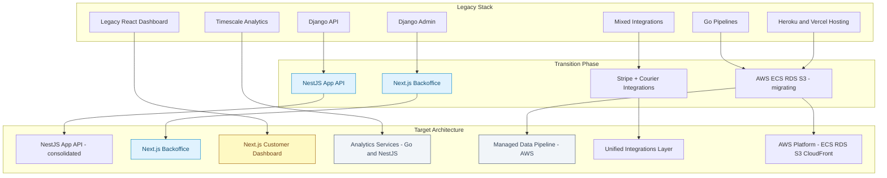

 
# 🏗️ Mobilytics Platform — Architecture Migration Strategy & Rationale  
*(v1.0 — Executive & Engineering Alignment)*  

## 1. Purpose  
This document explains **why** Mobilytics is rebuilding its core platform, **where** we are in the migration journey, and **what long-term benefits** it brings to customers, operations, and leadership.

---

## 2. Overview  
We are modernizing the Mobilytics platform to consolidate operations, reduce technical debt, and enable scalable SaaS growth.

- **Current:** fragmented, unreliable legacy Django + Go system.  
- **Goal:** unified AWS-based monorepo (NestJS + Next.js) powering all customer- and support-facing workflows.  
- **Migration in progress:** beginning with business logic and backoffice support surfaces.  

---

## 3. Current vs. Target Architecture  

| Layer | Today (Legacy) | Target (New Stack) | Migration Status |
|-------|----------------|--------------------|------------------|
| **Application Support API** | Django 5 API | NestJS | ✅ Active |
| **Internal Admin / Support UI** | Django Admin | Next.js Backoffice | ✅ Active |
| **Customer Dashboard** | React (legacy) | Next.js Customer App | 🚧 In Progress |
| **Analytics & Sensor API** | Django + Timescale | Go/NestJS Microservice | 🧱 Planned |
| **Data Pipeline** | Go / Python scripts | Managed AWS stack | 🧱 Planned |
| **Integrations** | Mixed scripts / webhooks | Unified NestJS service | ✅ Partial |
| **Hosting** | Heroku + Vercel | AWS ECS + RDS + S3 | ✅ Migrating |

---

## 4. Current Progress (2025)  

**Built & Functional**  
- NestJS API for orders, billing, fulfillment, shipments, tracking.  
- Next.js Backoffice app (alpha).  
- Courier adapters for USPS, DHL, Canada Post, Chit Chats.  
- Stripe integration with strict sync enforcement.  

**In Progress**  
- Customer dashboard app for campaigns & analytics.  
- Feature parity with Django API for operational flows.  

**Next Milestones**  
- Migrate analytics read APIs.  
- Begin sensor data replatform.  
- Retire legacy Django admin and dashboard.  

---

## 5. Why We’re Rebuilding  

| Legacy Pain Point | Strategic Benefit |
|--------------------|-------------------|
| Fragile, poorly tested legacy code. | Stable, documented, testable monorepo. |
| Disjointed APIs and workflows. | Unified API powering all apps and partners. |
| Slow development velocity. | Modern TypeScript stack for faster iteration. |
| Limited scalability. | AWS-native multi-tenant architecture. |
| Manual, inconsistent processes. | Automation and event-driven design. |
| Poor UX for ops and clients. | Modern, cohesive UIs for both audiences. |

---

## 6. Long-Term Benefits  

### For Customers  
- Reliable dashboards and automated reporting.  
- Faster campaign setup and billing clarity.  
- Improved analytics accuracy and data freshness.  

### For Operations  
- Unified backoffice replacing multiple tools.  
- Automated fulfillment and shipping visibility.  
- Fewer tickets and faster support responses.  

### For Leadership  
- Platform ready for SaaS commercialization.  
- Simplified roadmap execution and integrations.  
- Reduced hosting and maintenance costs.  

---

## 7. Visual Summary  

---

## 8. Key Messages for Stakeholders  
- This migration is **strategic**, not just technical.  
- It unlocks reliability, speed, and scalability.  
- Each phase delivers visible business improvements.  
- The end state positions Mobilytics as a **scalable SaaS platform** for the OOH industry.  
