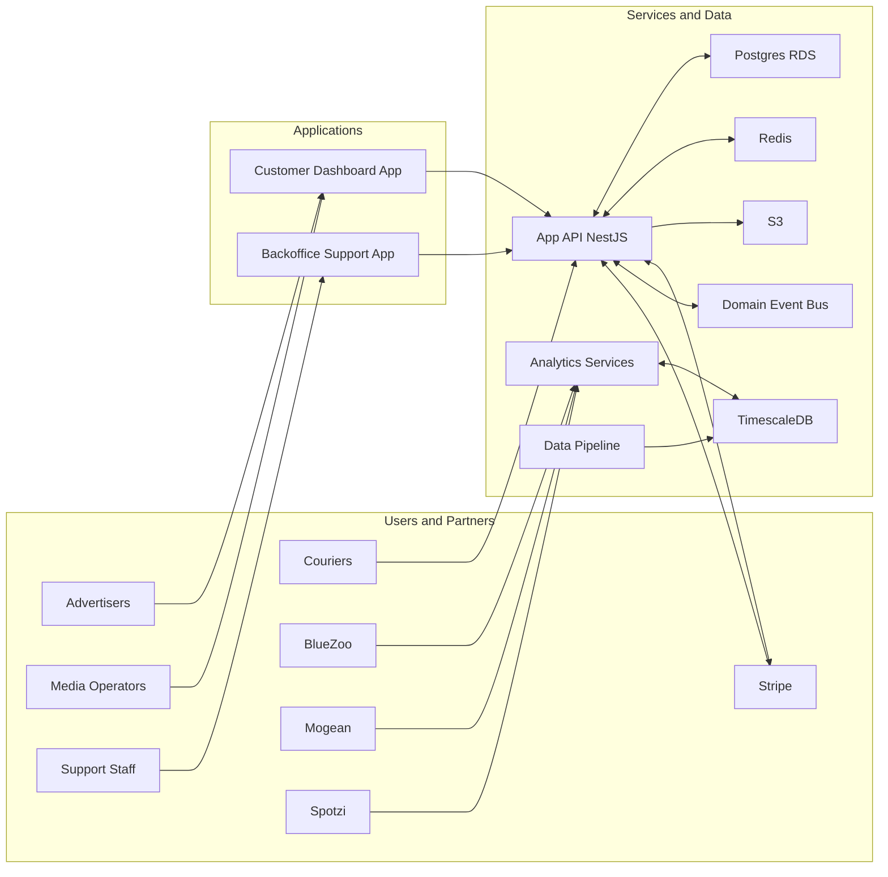
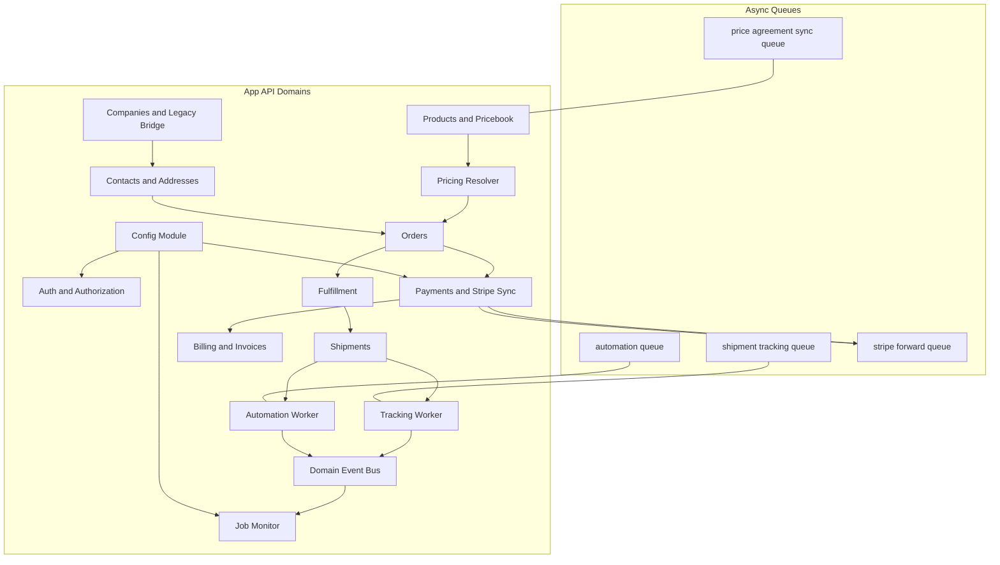

# Enterprise Architecture – Future State and Migration Strategy

This document outlines the future state of the Mobilytics Platform, the principles driving architectural decisions, and the migration strategy from the legacy stack. It complements domain specs in docs/architecture and ADRs in docs/adrs.

## 1. Objectives
- Unify operational and customer workflows under a modern, testable platform.
- Provide deterministic, auditable data flows from device to analytics to billing.
- Enable scale, reliability, and observability suitable for SaaS growth.
- Migrate safely from legacy via incremental, reversible steps.

## 2. Architecture Principles
- Domain driven design and modular boundaries aligned to business domains.
- Event driven collaboration using a shared domain event bus and durable audit trails.
- API first with typed DTOs and thin controllers; services own transactions and audit (ADR‑0007).
- Configuration via centralized module and strict env validation (ADR‑0006).
- Deterministic pricing and strict Stripe sync enforcement across order flows.
- Idempotency, retries with backoff, and dead letter handling across async jobs.
- Secure by default: least privilege RBAC, cookie based sessions, sanitized logs.
- Operability: metrics, structured logs, traces, and actionable alerts.

## 3. Context Diagram

## 4. Target Platform Components
- Backoffice Support App: Next.js app for internal operations and support.
- Customer Dashboard App: Next.js app for advertisers and operators.
- App API: NestJS service hosting domains for auth, orders, pricebook, payments, fulfillment, shipments, tracking, automation, billing, contacts, addresses, companies, and legacy bridge.
- Analytics Services: services providing metrics and exposure analytics.
- Data Pipeline: ingestion and transformation for sensor signals into analytics store.
- Data Stores: Postgres for business data, Redis for queues and caching, S3 for artifacts, Timescale for time series analytics.
- Integrations: Stripe checkout and webhooks, courier tracking, partner exports and callbacks.
- Observability: metrics, logs, traces, dashboarding, alerting.

## 5. App API Container View

## 6. Data Architecture
- Identifiers: cuid for primary keys and human readable external references via sequence service (ADR‑0001 and ADR‑0003).
- Relational core: Postgres for business entities with snake case mappings and enums (ADR‑0004).
- Time series: Timescale for exposure analytics and aggregates.
- Artifacts: S3 for PDFs and exports with signed access and lifecycle rules.
- Caching and queues: Redis supporting BullMQ queues and hot caches.
- Events and audit: persistent domain events and product events enabling timelines and projections.
- Integrity: transactions for multi step writes, idempotency keys for webhooks, unique constraints for invariants.

## 7. Security Architecture
- Authentication: cookie based JWT sessions, Google OAuth option; JWT signed with configurable secret and expiration.
- Authorization: role to permission mapping and allow deny rules with controller level guards and @Require annotations (ADR‑0005).
- Network and transport: TLS for all public endpoints, signed webhooks, and origin restricted CORS.
- Data protection: encryption at rest backed by platform defaults, signed URLs for artifacts, and minimal PII in logs.
- Secrets and config: all configuration via AppConfigService and validated schema (ADR‑0006). Keys loaded from environment or secret manager.

## 8. Reliability and Scalability
- SLO targets: core API availability at or above three nines, queue latency targets per workload.
- Resilience: retries with backoff, circuit breakers for legacy and partners, bulkheads per queue, and dead letter handling.
- Idempotency: enforced across webhook handlers and async job processors.
- Scale out: horizontal scaling for web and worker pods; database and cache sizing to match throughput; CDN and caching for frontends.
- Backups and restore: scheduled backups for Postgres, lifecycle policies for S3, disaster recovery playbooks.

## 9. Migration Strategy
- Strangler pattern: new domains and surfaces in App API and frontends; legacy functionality proxied through facades where required.
- Mirrors and facades: company, device, and asset mirrors provide read through access and TTL based refresh to decouple UI from legacy.
- Webhook fan out: Stripe events processed in the new API and forwarded to legacy until decommissioned, with idempotency and retries.
- Dual running and cutover: critical paths validated with fixtures and simulators; progressive enablement via feature flags and configuration.
- Data reconciliation: nightly or scheduled tasks to refresh mirrors and detect drift; import and conflict resolution tooling.

## 10. Governance and Delivery
- ADRs: architectural decisions captured and enforced across code review and CI.
- Contracts: DTOs and API schemas owned by services; contract tests and typed clients for frontends.
- CI and CD: build, lint, typecheck, and test gates; migration and seed orchestration for environments.
- Feature flags and configuration toggles to decouple deploy from release.

## 11. Observability and Operations
- Metrics: domain and queue metrics for throughput, latency, error rate, and SLA compliance.
- Logs: structured logs with correlation identifiers to trace requests and jobs.
- Traces: end to end traces across API, workers, and external calls where supported.
- Alerting: actionable alerts on SLO breaches, queue backlogs, webhook failures, and tracking adapter errors.

## 12. Compliance and Privacy
- Data retention and lifecycle management for artifacts and logs.
- Access controls for staff roles; least privilege across environments.
- Privacy by design: minimize PII where possible and document data flows.

## 13. Risks and Mitigations
- Legacy coupling: mitigated with mirrors, facades, and fan out.
- Partner reliability: retries, circuit breakers, and DLQs.
- Data integrity: deterministic pricing, strict checkout enforcement, and audit trails.
- Operational load: job monitor and dashboards to manage backlog and retry storms.

## 14. Roadmap Alignment
- Near term: complete backoffice parity, stabilize shipment tracking and automation, and invoice issuance.
- Mid term: customer dashboard, analytics service replatform, and partner exports.
- Long term: device monitoring, SaaS multi tenant enablement, and advanced pricing agreements.

## 15. References
- Orders and Pricing Integration: docs/architecture/domain-orders-pricing.md
- Fulfillment and Shipments: docs/architecture/domain-fulfillment-shipments.md
- Automation and Async Processing: docs/architecture/domain-automation-async.md
- Billing and Invoices: docs/architecture/domain-billing-invoices.md
- Contacts and Addresses: docs/architecture/domain-contacts-addresses.md
- Price Agreements: docs/architecture/domain-price-agreements.md
- Domain Event Bus: docs/architecture/domain-event-bus.md
- Legacy Bridge: docs/architecture/legacy-integration-bridge.md
- ADRs Index: docs/adrs
